<h1 align="center"> 📒 STM32F103知识整理</h1> 

## 📃 前言

* 读者可以根据自己的需要进行页面的跳转学习
* 每个知识点的最后都有**相对应的例子**
* 格式为：**先说明理论，后函数，最后例子**
* 让我们开始学习吧 🤓

## 🖊 笔记总览

> [00 - STM32F103引脚定义](# 📐 STM32F103引脚定义)
>
> [01 - GPIO控制](# 🎓 GPIO控制)
>
> [02 - 外部中断控制](# 引脚定义)
>
> [03 - TIM定时中断](# 引脚定义)
>
> [04 - 编码器接口](# 引脚定义)
>
> [05 - PWM输出](# 引脚定义)
>
> [06 - IC输入捕获](# 引脚定义)
>
> [06 - UART串口协议](# 引脚定义)
>
> [07 - IIC通信协议](# 引脚定义)
>
> [08 - SPI通信协议](# 引脚定义)
>
> [09 - ADC模数转换](# 引脚定义)
>
> [10 - DMA数据搬运](# 引脚定义)

## 📐 STM32F103引脚定义

> 

## 🎓 GPIO控制

#### ✏ GPIO简介

- GPIO（General Purpose Input Output）通用输入输出口
- 可配置为8种输入输出模式
- 引脚电平：**0V~3.3V**，部分引脚可容忍5V
- 输出模式下可控制端口输出高低电平，用以驱动LED、控制蜂鸣器、模拟通信协议输出时序等
- 输入模式下可读取端口的高低电平或电压，用于读取按键输入、外接模块电平信号输入、ADC电压采集、模拟通信协议接收数据等

#### ✏ GPIO基本流程图

- GPIO挂载在**APB2**总线上

> 

- GPIO基本运行结构框图

>

#### ✏ GPIO模式

| 模式名称       | 性质       | 特征                                     |
|----------------|------------|------------------------------------------|
| 浮空输入       | 数字输入   | 可读取引脚电平，若引脚悬空，则电平不确定 |
| 上拉输入       | 数字输入   | 可读取引脚电平，内部连接上拉电阻，悬空时默认高电平 |
| 下拉输入       | 数字输入   | 可读取引脚电平，内部连接下拉电阻，悬空时默认低电平 |
| 模拟输入       | 模拟输入   | GPIO无效，引脚直接接入内部ADC            |
| 开漏输出       | 数字输出   | 可输出引脚电平，高电平为高阻态，低电平接VSS |
| 推挽输出       | 数字输出   | 可输出引脚电平，高电平接VDD，低电平接VSS |
| 复用开漏输出   | 数字输出   | 由片上外设控制，高电平为高阻态，低电平接VSS |
| 复用推挽输出   | 数字输出   | 由片上外设控制，高电平接VDD，低电平接VSS |

>

#### ✏ GPIO配置常用函数

> 

> 

#### ✏ 点亮一个LED灯

``` c
#include "stm32f10x.h"                  // Device header

/**
  * 函    数：LED初始化
  * 参    数：无
  * 返 回 值：无
  */
void LED_Init(void)
{
	/*开启时钟*/
	RCC_APB2PeriphClockCmd(RCC_APB2Periph_GPIOA, ENABLE);		//开启GPIOA的时钟
	
	/*GPIO初始化*/
	GPIO_InitTypeDef GPIO_InitStructure;
	GPIO_InitStructure.GPIO_Mode = GPIO_Mode_Out_PP;
	GPIO_InitStructure.GPIO_Pin = GPIO_Pin_1;
	GPIO_InitStructure.GPIO_Speed = GPIO_Speed_50MHz;
	GPIO_Init(GPIOA, &GPIO_InitStructure);						//将PA1引脚初始化为推挽输出
	
	/*设置GPIO初始化后的默认电平*/
	GPIO_SetBits(GPIOA, GPIO_Pin_1);				//设置PA1引脚为高电平
}

/**
  * 函    数：LED开启
  * 参    数：无
  * 返 回 值：无
  */
void LED_ON(void)
{
	GPIO_ResetBits(GPIOA, GPIO_Pin_1);		//设置PA1引脚为低电平
}

/**
  * 函    数：LED关闭
  * 参    数：无
  * 返 回 值：无
  */
void LED_OFF(void)
{
	GPIO_SetBits(GPIOA, GPIO_Pin_1);		//设置PA1引脚为高电平
}
```

## 😎 外部中断控制

#### 😎 中断系统

- **中断：**在主程序运行过程中，出现了特定的中断触发条件（中断源），使得CPU暂停当前正在运行的程序，转而去处理中断程序，处理完成后又返回原来被暂停的位置继续运行，也就是说***<u>发生事件后跳转到对应的程序执行完回来</u>***。
- **中断优先级：**当有多个中断源同时申请中断时，CPU会根据中断源的轻重缓急进行裁决，优先响应更加紧急的中断源，也就是***<u>排队</u>***。
- **中断嵌套：**当一个中断程序正在运行时，又有新的更高优先级的中断源申请中断，CPU再次暂停当前中断程序，转而去处理新的中断程序，处理完成后依次进行返回，也就是***<u>可以打断函数的中断，优先执行</u>***。

> 

#### 😎 STM32F103中断

- ***<u>68</u>***个可屏蔽中断通道，包含EXTI、TIM、ADC、USART、SPI、I2C、RTC等多个外设
- 使用NVIC统一管理中断，每个中断通道都拥有***<u>16</u>***个可编程的优先等级，可对优先级进行分组，进一步设置抢占优先级和响应优先级，也就是***<u>NVIC控制中断优先级</u>***。

> 

#### 😎 外部中断触发流程图

- AFIO为***中断引角选择***，主要用于处理***引脚复用***之类的情况

- EXTI为***申请中断***，就像***学生举手打报告说我要做某件事一样***，向NVIC说明要进行中断了

- NVIC为***处理中断申请***，就像***秘书处理一些申请，把申请按照紧急程度排序一样***，用于跟CPU说你需要处理什么事情，而***CPU只需要埋头苦干***😭就可以

  > 

#### 😎 NVIC中断优先级选择

- NVIC的中断优先级由优先级寄存器的***<u>4位（0~15）</u>***决定，这4位可以进行切分，分为高n位的抢占优先级和低4-n位的响应优先级

- 抢占优先级高的可以中断嵌套，响应优先级高的可以优先排队，抢占优先级和响应优先级均相同的按中断号排队

| 分组方式 | 抢占优先级（插队） | 响应优先级（排队） |
| :------: | :--------: | :--------: |
|  分组0   | 0位, 取值为0 | 4位, 取值为0~15 |
|  分组1   | 1位, 取值为0~1 | 3位, 取值为0~7 |
|  分组2   | 2位, 取值为0~3 | 2位, 取值为0~3 |
|  分组3   | 3位, 取值为0~7 | 1位, 取值为0~1 |
|  分组4   | 4位, 取值为0~15 | 0位, 取值为0 |

> 

#### 😎 EXTI外部中断

- EXTI（Extern Interrupt）外部中断
- EXTI可以***<u>检测引脚电平变化，申请中断</u>***
- 支持的触发方式：上升沿/下降沿/双边沿/软件触发
- 支持的GPIO口：所有GPIO口，但***<u>相同的Pin不能同时触发中断</u>***，比如***<u>PA0和PB0</u>***就不行
- 通道数：16个GPIO_Pin，外加PVD输出、RTC闹钟、USB唤醒、以太网唤醒
- 触发响应方式：中断响应/事件响应，事件响应就是不进去CPU，直接触发ADC/DMA

> 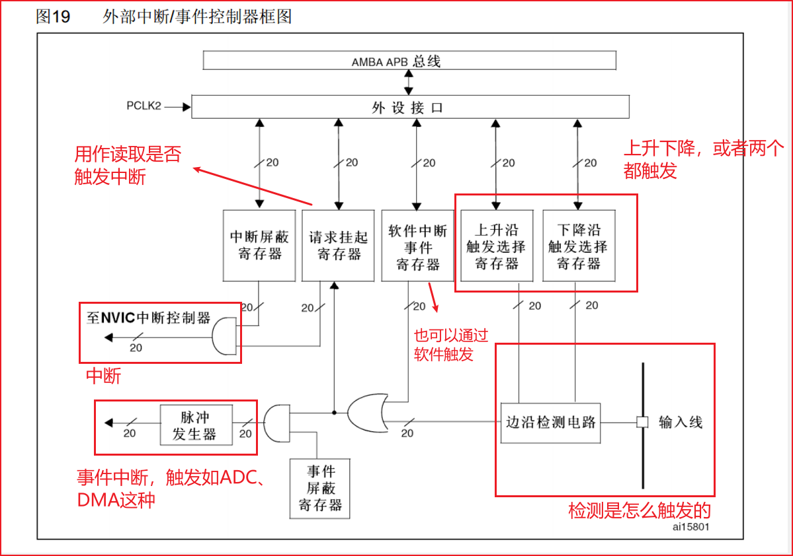

#### 😎 AFIO中断引脚选择

- AFIO主要用于***<u>引脚复用功能的选择和重定义</u>***，通俗来讲就是***<u>去选择哪个引脚作为中断</u>***
- 在STM32中，AFIO主要完成两个任务：***<u>复用功能引脚重映射、中断引脚选择</u>***

#### 😎 外部中断配置常用函数

> 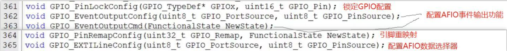
>
> 
>
> 

#### 😎 对射式红外传感器计次

``` c
#include "stm32f10x.h"                  // Device header

uint16_t CountSensor_Count;				//全局变量，用于计数

/**
  * 函    数：计数传感器初始化
  * 参    数：无
  * 返 回 值：无
  */
void CountSensor_Init(void)
{
	/*开启时钟*/
	RCC_APB2PeriphClockCmd(RCC_APB2Periph_GPIOB, ENABLE);		//开启GPIOB的时钟
	RCC_APB2PeriphClockCmd(RCC_APB2Periph_AFIO, ENABLE);		//开启AFIO的时钟，外部中断必须开启AFIO的时钟
	
	/*GPIO初始化*/
	GPIO_InitTypeDef GPIO_InitStructure;
	GPIO_InitStructure.GPIO_Mode = GPIO_Mode_IPU;
	GPIO_InitStructure.GPIO_Pin = GPIO_Pin_14;
	GPIO_InitStructure.GPIO_Speed = GPIO_Speed_50MHz;
	GPIO_Init(GPIOB, &GPIO_InitStructure);						//将PB14引脚初始化为上拉输入
	
	/*AFIO选择中断引脚*/
	GPIO_EXTILineConfig(GPIO_PortSourceGPIOB, GPIO_PinSource14);//将外部中断的14号线映射到GPIOB，即选择PB14为外部中断引脚
	
	/*EXTI初始化*/
	EXTI_InitTypeDef EXTI_InitStructure;						//定义结构体变量
	EXTI_InitStructure.EXTI_Line = EXTI_Line14;					//选择配置外部中断的14号线
	EXTI_InitStructure.EXTI_LineCmd = ENABLE;					//指定外部中断线使能
	EXTI_InitStructure.EXTI_Mode = EXTI_Mode_Interrupt;			//指定外部中断线为中断模式
	EXTI_InitStructure.EXTI_Trigger = EXTI_Trigger_Falling;		//指定外部中断线为下降沿触发
	EXTI_Init(&EXTI_InitStructure);								//将结构体变量交给EXTI_Init，配置EXTI外设
	
	/*NVIC中断分组*/
	NVIC_PriorityGroupConfig(NVIC_PriorityGroup_2);				//配置NVIC为分组2
																//即抢占优先级范围：0~3，响应优先级范围：0~3
																//此分组配置在整个工程中仅需调用一次
																//若有多个中断，可以把此代码放在main函数内，while循环之前
																//若调用多次配置分组的代码，则后执行的配置会覆盖先执行的配置
	
	/*NVIC配置*/
	NVIC_InitTypeDef NVIC_InitStructure;						//定义结构体变量
	NVIC_InitStructure.NVIC_IRQChannel = EXTI15_10_IRQn;		//选择配置NVIC的EXTI15_10线
	NVIC_InitStructure.NVIC_IRQChannelCmd = ENABLE;				//指定NVIC线路使能
	NVIC_InitStructure.NVIC_IRQChannelPreemptionPriority = 1;	//指定NVIC线路的抢占优先级为1
	NVIC_InitStructure.NVIC_IRQChannelSubPriority = 1;			//指定NVIC线路的响应优先级为1
	NVIC_Init(&NVIC_InitStructure);								//将结构体变量交给NVIC_Init，配置NVIC外设
}

/**
  * 函    数：获取计数传感器的计数值
  * 参    数：无
  * 返 回 值：计数值，范围：0~65535
  */
uint16_t CountSensor_Get(void)
{
	return CountSensor_Count;
}

/**
  * 函    数：EXTI15_10外部中断函数
  * 参    数：无
  * 返 回 值：无
  * 注意事项：此函数为中断函数，无需调用，中断触发后自动执行
  *           函数名为预留的指定名称，可以从启动文件复制
  *           请确保函数名正确，不能有任何差异，否则中断函数将不能进入
  */
void EXTI15_10_IRQHandler(void)
{
	if (EXTI_GetITStatus(EXTI_Line14) == SET)		//判断是否是外部中断14号线触发的中断
	{
		/*如果出现数据乱跳的现象，可再次判断引脚电平，以避免抖动*/
		if (GPIO_ReadInputDataBit(GPIOB, GPIO_Pin_14) == 0)
		{
			CountSensor_Count ++;					//计数值自增一次
		}
		EXTI_ClearITPendingBit(EXTI_Line14);		//清除外部中断14号线的中断标志位
													//中断标志位必须清除
													//否则中断将连续不断地触发，导致主程序卡死
	}
}

```

## ⏱ TIM定时中断

#### ⏱ TIM简介

- TIM（Timer）定时器
- 定时器可以对输入的时钟进行计数，并在计数值达到设定值时触发中断
- 16位***<u>计数器、预分频器、自动重装寄存器</u>***的时基单元，在72MHz计数时钟下可以实现最大59.65s的定时
- 不仅具备基本的定时中断功能，而且还包含内外时钟源选择、输入捕获、输出比较、编码器接口、主从触发模式等多种功能
- 根据复杂度和应用场景分为了高级定时器、通用定时器、基本定时器三种类型

#### ⏱ 时钟树

> 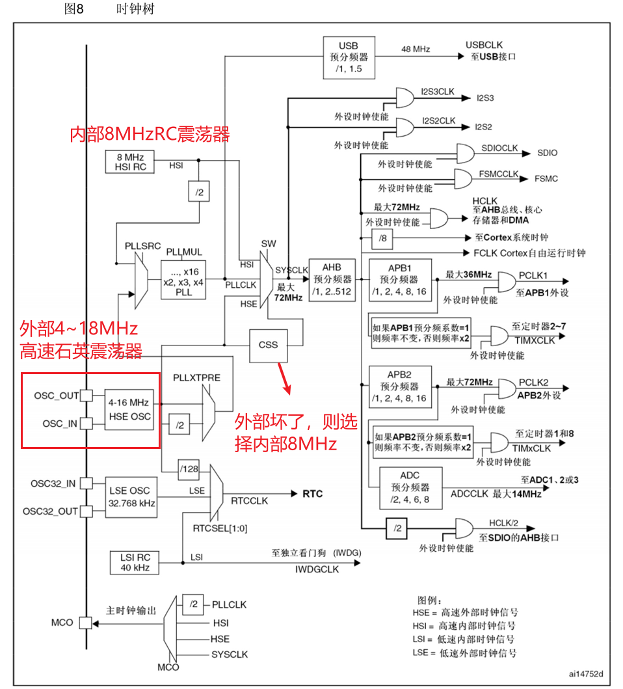

#### ⏱ 定时器类型

##### ⏱ STM32F103定时器资源

| 类型 | 编号 | 总线 | 功能 |
| :--- | :--- | :--- | :--- |
| 高级定时器 | TIM1、TIM8 | APB2 | 拥有通用定时器全部功能，并额外具有重复计数器、死区生成、互补输出、刹车输入等功能 |
| 通用定时器 | TIM2、TIM3、TIM4、TIM5 | APB1 | 拥有基本定时器全部功能，并额外具有内外时钟源选择、输入捕获、输出比较、编码器接口、主从触发模式等功能 |
| 基本定时器 | TIM6、TIM7 | APB1 | 拥有定时中断、主模式触发DAC的功能 |

> 注：STM32F103C8T6定时器资源：***<u>TIM1、TIM2、TIM3、TIM4</u>***

##### ⏱ 基本定时器

- 通俗来说，基本定时器主要用于***<u>最基础的定时中断</u>***，只需要记住3个参数的作用，没有其他复杂功能，定时中断如图所示
- ***<u>PSC</u>***：预分频器，用于***<u>对输入时钟进行分频，降低计数器的计数频率</u>***
- ***<u>CNT</u>***：计数器，用于计数，***<u>每隔一个时钟计数器加1</u>***
- ***<u>ARR</u>***：自动重装载寄存器，用于***<u>设定计数器的计数上限，当计数器的值达到ARR时，计数器清零重新开始计数，并触发更新事件(也就是定时中断)</u>***
- 主要用于定时触发中断、触发DAC转换

> 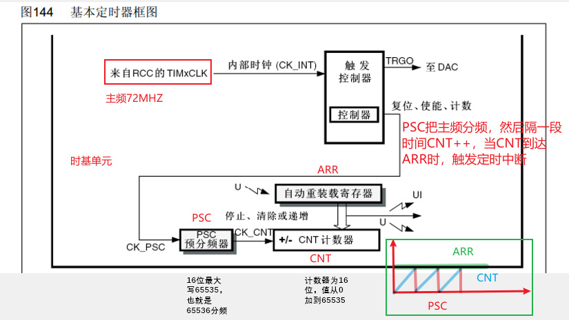

##### ⏱ 通用定时器

- 就是多加了***<u>输入捕获、输出比较（PWM）、编码器接口、还有定时器的级联等功能</u>***

> 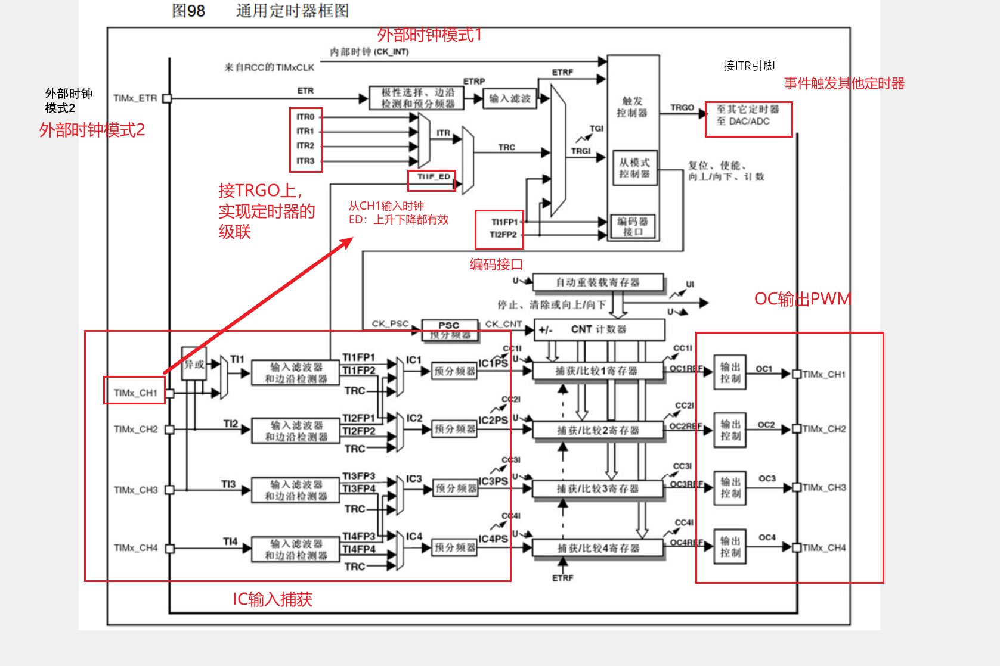

- 下表为定时器级联功能，***<u>TIM2 的 ITR0接在 TIM1 的 TRGO 上</u>***

| 从定时器 | ITR0 (TS = 000) | ITR1 (TS = 001) | ITR2 (TS = 010) | ITR3 (TS = 011) |
| :------: | :-------------: | :-------------: | :-------------: | :-------------: |
|   TIM2   |      TIM1       |      TIM8       |      TIM3       |      TIM4       |
|   TIM3   |      TIM1       |      TIM2       |      TIM5       |      TIM4       |
|   TIM4   |      TIM1       |      TIM2       |      TIM3       |      TIM8       |
|   TIM5   |      TIM2       |      TIM3       |      TIM4       |      TIM8       |

> 如果某个产品中没有相应的定时器，则对应的触发信号 ITRx 也不存在。

##### ⏱ 高级定时器

- 相比于通用定时器，就是多加了***<u>死区时间生成、互补输出、刹车功能等高级功能</u>***
> 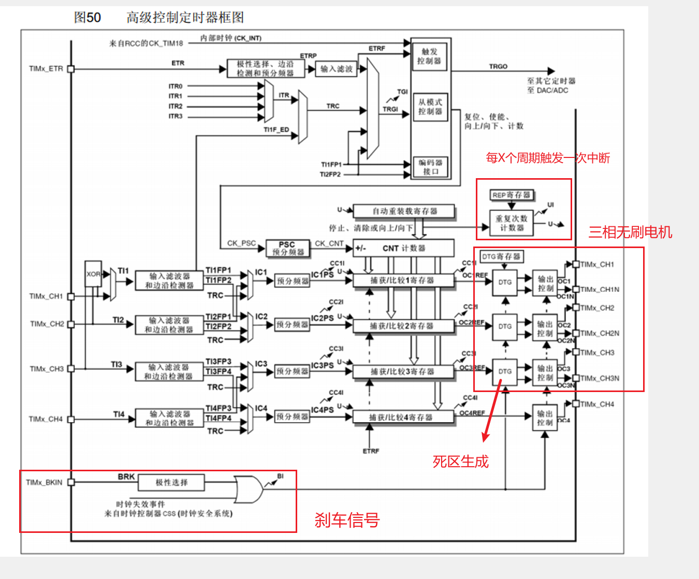

#### ⏱ 定时中断流程图（包含计算公式）

- ***<u>中断频率 = 定时器时钟频率 / (PSC + 1) / (ARR + 1)</u>***
- ***<u>中断时间 = 1 / 中断频率</u>***
> 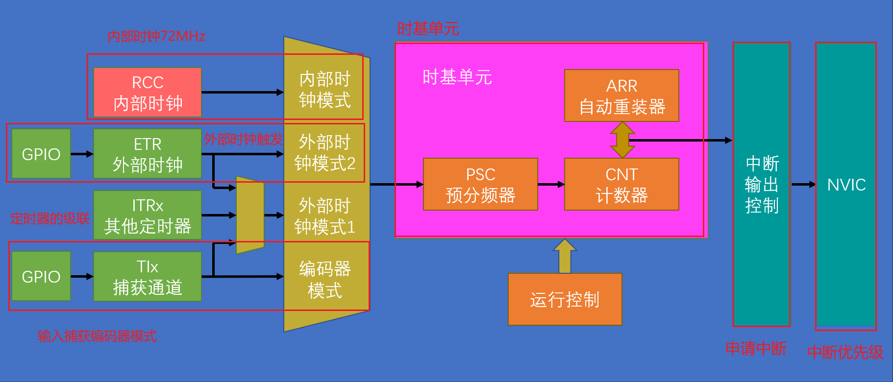

#### ⏱ 定时器配置常用函数

> 

#### ⏱ 定时器中断实现每隔1秒中断一次

``` c
#include "stm32f10x.h"                  // Device header

/**
  * 函    数：定时中断初始化
  * 参    数：无
  * 返 回 值：无
  */
void Timer_Init(void)
{
	/*开启时钟*/
	RCC_APB1PeriphClockCmd(RCC_APB1Periph_TIM2, ENABLE);			//开启TIM2的时钟
	
	/*配置时钟源*/
	TIM_InternalClockConfig(TIM2);		//选择TIM2为内部时钟，若不调用此函数，TIM默认也为内部时钟
	
	/*时基单元初始化*/
	TIM_TimeBaseInitTypeDef TIM_TimeBaseInitStructure;				//定义结构体变量
	TIM_TimeBaseInitStructure.TIM_ClockDivision = TIM_CKD_DIV1;		//时钟分频，选择不分频，此参数用于配置滤波器时钟，不影响时基单元功能
	TIM_TimeBaseInitStructure.TIM_CounterMode = TIM_CounterMode_Up;	//计数器模式，选择向上计数
	TIM_TimeBaseInitStructure.TIM_Period = 10000 - 1;				//计数周期，即ARR的值
	TIM_TimeBaseInitStructure.TIM_Prescaler = 7200 - 1;				//预分频器，即PSC的值
	TIM_TimeBaseInitStructure.TIM_RepetitionCounter = 0;			//重复计数器，高级定时器才会用到
	TIM_TimeBaseInit(TIM2, &TIM_TimeBaseInitStructure);				//将结构体变量交给TIM_TimeBaseInit，配置TIM2的时基单元	
	
	/*中断输出配置*/
	TIM_ClearFlag(TIM2, TIM_FLAG_Update);						//清除定时器更新标志位
																//TIM_TimeBaseInit函数末尾，手动产生了更新事件
																//若不清除此标志位，则开启中断后，会立刻进入一次中断
																//如果不介意此问题，则不清除此标志位也可
	
	TIM_ITConfig(TIM2, TIM_IT_Update, ENABLE);					//开启TIM2的更新中断
	
	/*NVIC中断分组*/
	NVIC_PriorityGroupConfig(NVIC_PriorityGroup_2);				//配置NVIC为分组2
																//即抢占优先级范围：0~3，响应优先级范围：0~3
																//此分组配置在整个工程中仅需调用一次
																//若有多个中断，可以把此代码放在main函数内，while循环之前
																//若调用多次配置分组的代码，则后执行的配置会覆盖先执行的配置
	
	/*NVIC配置*/
	NVIC_InitTypeDef NVIC_InitStructure;						//定义结构体变量
	NVIC_InitStructure.NVIC_IRQChannel = TIM2_IRQn;				//选择配置NVIC的TIM2线
	NVIC_InitStructure.NVIC_IRQChannelCmd = ENABLE;				//指定NVIC线路使能
	NVIC_InitStructure.NVIC_IRQChannelPreemptionPriority = 2;	//指定NVIC线路的抢占优先级为2
	NVIC_InitStructure.NVIC_IRQChannelSubPriority = 1;			//指定NVIC线路的响应优先级为1
	NVIC_Init(&NVIC_InitStructure);								//将结构体变量交给NVIC_Init，配置NVIC外设
	
	/*TIM使能*/
	TIM_Cmd(TIM2, ENABLE);			//使能TIM2，定时器开始运行
}

/* 定时器中断函数，可以复制到使用它的地方
void TIM2_IRQHandler(void)
{
	if (TIM_GetITStatus(TIM2, TIM_IT_Update) == SET)
	{
		
		TIM_ClearITPendingBit(TIM2, TIM_IT_Update);
	}
}
*/

```

## ⚙ TIM编码器接口

#### ⚙ 编码器接口简介

- Encoder Interface 编码器接口
- 编码器通俗来讲主要用于***<u>检测物体的旋转方向和速度</u>***
- 编码器接口可接收增量（正交）编码器的信号，根据编码器旋转产生的正交信号脉冲，***<u>自动控制CNT自增或自减</u>***，从而指示编码器的位置、旋转方向和旋转速度
- 每个高级定时器和通用定时器都***<u>只有1个编码器接口</u>***，接口为***<u>通道1和通道2</u>***

#### ⚙ 编码器接口基本流程图

> 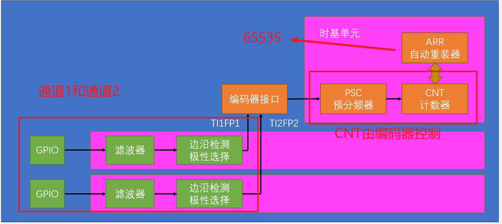

#### ⚙ 编码器接口工作（计数）模式

> 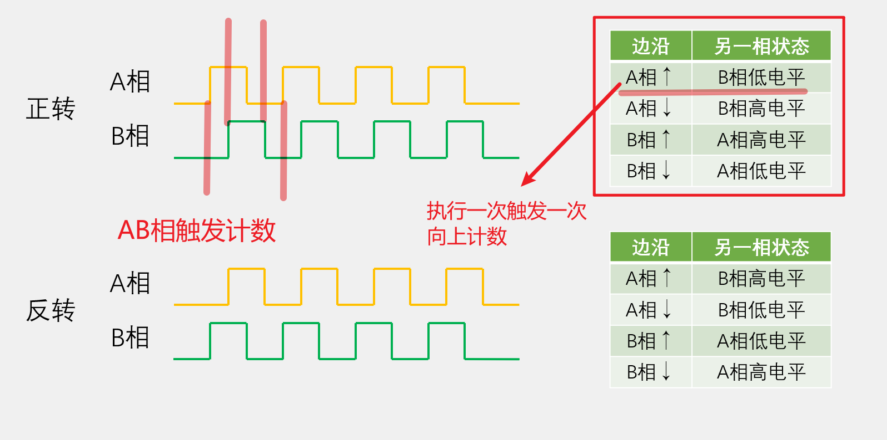

#### ⚙ 编码器接口配置常用函数

> 

#### ⚙ 编码器接口实现编码器测速

``` c
#include "stm32f10x.h"                  // Device header
 
/**
  * 函    数：编码器初始化
  * 参    数：无
  * 返 回 值：无
  */
void Encoder_Init(void)
{
	/*开启时钟*/
	RCC_APB1PeriphClockCmd(RCC_APB1Periph_TIM3, ENABLE);			//开启TIM3的时钟
	RCC_APB2PeriphClockCmd(RCC_APB2Periph_GPIOA, ENABLE);			//开启GPIOA的时钟
	
	/*GPIO初始化*/
	GPIO_InitTypeDef GPIO_InitStructure;
	GPIO_InitStructure.GPIO_Mode = GPIO_Mode_IPU;
	GPIO_InitStructure.GPIO_Pin = GPIO_Pin_6 | GPIO_Pin_7;
	GPIO_InitStructure.GPIO_Speed = GPIO_Speed_50MHz;
	GPIO_Init(GPIOA, &GPIO_InitStructure);							//将PA6和PA7引脚初始化为上拉输入
	
	/*时基单元初始化*/
	TIM_TimeBaseInitTypeDef TIM_TimeBaseInitStructure;				//定义结构体变量
	TIM_TimeBaseInitStructure.TIM_ClockDivision = TIM_CKD_DIV1;     //时钟分频，选择不分频，此参数用于配置滤波器时钟，不影响时基单元功能
	TIM_TimeBaseInitStructure.TIM_CounterMode = TIM_CounterMode_Up; //计数器模式，选择向上计数
	TIM_TimeBaseInitStructure.TIM_Period = 65536 - 1;               //计数周期，即ARR的值
	TIM_TimeBaseInitStructure.TIM_Prescaler = 1 - 1;                //预分频器，即PSC的值
	TIM_TimeBaseInitStructure.TIM_RepetitionCounter = 0;            //重复计数器，高级定时器才会用到
	TIM_TimeBaseInit(TIM3, &TIM_TimeBaseInitStructure);             //将结构体变量交给TIM_TimeBaseInit，配置TIM3的时基单元
	
	/*输入捕获初始化*/
	TIM_ICInitTypeDef TIM_ICInitStructure;							//定义结构体变量
	TIM_ICStructInit(&TIM_ICInitStructure);							//结构体初始化，若结构体没有完整赋值
																	//则最好执行此函数，给结构体所有成员都赋一个默认值
																	//避免结构体初值不确定的问题
	TIM_ICInitStructure.TIM_Channel = TIM_Channel_1;				//选择配置定时器通道1
	TIM_ICInitStructure.TIM_ICFilter = 0xF;							//输入滤波器参数，可以过滤信号抖动
	TIM_ICInit(TIM3, &TIM_ICInitStructure);							//将结构体变量交给TIM_ICInit，配置TIM3的输入捕获通道
	TIM_ICInitStructure.TIM_Channel = TIM_Channel_2;				//选择配置定时器通道2
	TIM_ICInitStructure.TIM_ICFilter = 0xF;							//输入滤波器参数，可以过滤信号抖动
	TIM_ICInit(TIM3, &TIM_ICInitStructure);							//将结构体变量交给TIM_ICInit，配置TIM3的输入捕获通道
	
	/*编码器接口配置*/
	TIM_EncoderInterfaceConfig(TIM3, TIM_EncoderMode_TI12, TIM_ICPolarity_Rising, TIM_ICPolarity_Rising);
																	//配置编码器模式以及两个输入通道是否反相
																	//注意此时参数的Rising和Falling已经不代表上升沿和下降沿了，而是代表是否反相
																	//此函数必须在输入捕获初始化之后进行，否则输入捕获的配置会覆盖此函数的部分配置
	
	/*TIM使能*/
	TIM_Cmd(TIM3, ENABLE);			//使能TIM3，定时器开始运行
}
 
/**
  * 函    数：获取编码器的增量值
  * 参    数：无
  * 返 回 值：自上此调用此函数后，编码器的增量值
  */
int16_t Encoder_Get(void)
{
	/*使用Temp变量作为中继，目的是返回CNT后将其清零*/
	int16_t Temp;
	Temp = TIM_GetCounter(TIM3);
	TIM_SetCounter(TIM3, 0);
	return Temp;
}
```

## 🔬 TIM输出比较（PWM输出）

#### 🔬 输出比较（PWM）简介

- OC（Output Compare）输出比较，PWM（Pulse Width Modulation）脉宽调制
- ***<u>OC输出比较</u>***可以理解为给定时器设置的一个“闹钟”。定时器从0开始数数，当数到你设定的值（CCR）时，就会触发一个动作，比如翻转电平。
- ***<u>PWM脉宽调制</u>***就是利用这个“闹钟”功能来生成一种特殊的方波。通过改变“闹钟”设定的时间点（CCR），我们就能控制方波高电平的持续时间（即***<u>占空比</u>***）。
- 这个占空比可以用来控制很多东西，比如***<u>调节LED的亮度、控制舵机的角度或电机的转速</u>***。
- STM32的每个通用/高级定时器都有***<u>4个</u>***这样的“闹钟”（输出比较通道），所以能同时独立控制4路PWM输出。

#### 🔬 输出比较（PWM）基本流程图

- PWM的本质就是控制占空比的大小，占空比越大，驱动能力就越强，***<u>只要我闪的够快，就没人发现我灯灭了</u>***；

> 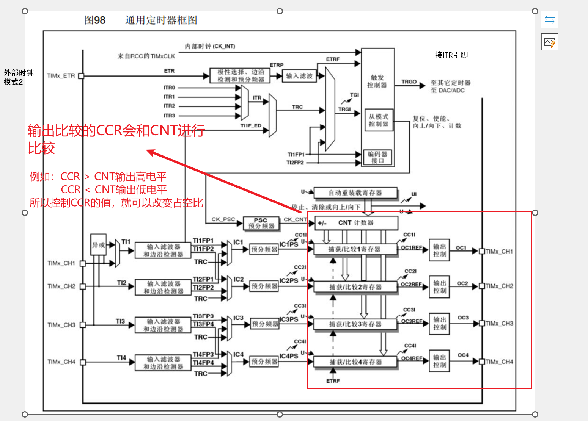
> 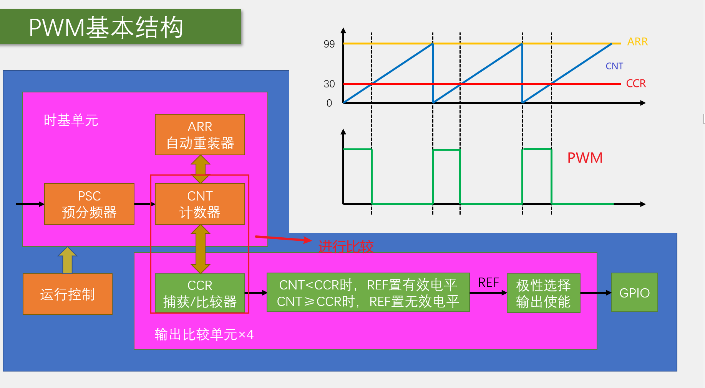

#### 🔬 输出比较（PWM）电平翻转

| 模式               | 描述                                                                                           |
|--------------------|------------------------------------------------------------------------------------------------|
| 冻结               | CNT=CCR时，REF保持为原状态                                                                     |
| 匹配时置有效电平   | CNT=CCR时，REF置有效电平                                                                       |
| 匹配时置无效电平   | CNT=CCR时，REF置无效电平                                                                       |
| 匹配时电平翻转     | CNT=CCR时，REF电平翻转                                                                         |
| 强制为无效电平     | CNT与CCR无效，REF强制为无效电平                                                               |
| 强制为有效电平     | CNT与CCR无效，REF强制为有效电平                                                               |
| PWM模式1           | 向上计数：CNT<CCR时，REF置有效电平；CNT≥CCR时，REF置无效电平<br>向下计数：CNT>CCR时，REF置无效电平；CNT≤CCR时，REF置有效电平 |
| PWM模式2           | 向上计数：CNT<CCR时，REF置无效电平；CNT≥CCR时，REF置有效电平<br>向下计数：CNT>CCR时，REF置有效电平；CNT≤CCR时，REF置无效电平 |

#### 🔬 输出比较（PWM）计算公式

> 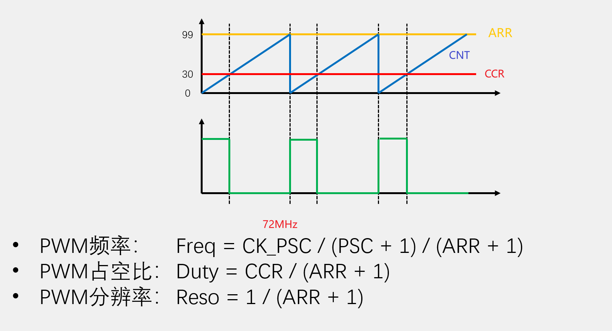

#### 🔬 输出比较（PWM）配置常用函数

> 

#### 🔬 输出比较（PWM）实现PWM输出控制LED亮度

``` c
#include "stm32f10x.h"                  // Device header
 
/**
  * 函    数：PWM初始化
  * 参    数：无
  * 返 回 值：无
  */
void PWM_Init(void)
{
	/*开启时钟*/
	RCC_APB1PeriphClockCmd(RCC_APB1Periph_TIM2, ENABLE);			//开启TIM2的时钟
	RCC_APB2PeriphClockCmd(RCC_APB2Periph_GPIOA, ENABLE);			//开启GPIOA的时钟
	
	/*GPIO初始化*/
	GPIO_InitTypeDef GPIO_InitStructure;
	GPIO_InitStructure.GPIO_Mode = GPIO_Mode_AF_PP;
	GPIO_InitStructure.GPIO_Pin = GPIO_Pin_1;
	GPIO_InitStructure.GPIO_Speed = GPIO_Speed_50MHz;
	GPIO_Init(GPIOA, &GPIO_InitStructure);							//将PA1引脚初始化为复用推挽输出	
																	//受外设控制的引脚，均需要配置为复用模式
	
	/*配置时钟源*/
	TIM_InternalClockConfig(TIM2);		//选择TIM2为内部时钟，若不调用此函数，TIM默认也为内部时钟
	
	/*时基单元初始化*/
	TIM_TimeBaseInitTypeDef TIM_TimeBaseInitStructure;				//定义结构体变量
	TIM_TimeBaseInitStructure.TIM_ClockDivision = TIM_CKD_DIV1;     //时钟分频，选择不分频，此参数用于配置滤波器时钟，不影响时基单元功能
	TIM_TimeBaseInitStructure.TIM_CounterMode = TIM_CounterMode_Up; //计数器模式，选择向上计数
	TIM_TimeBaseInitStructure.TIM_Period = 20000 - 1;				//计数周期，即ARR的值
	TIM_TimeBaseInitStructure.TIM_Prescaler = 72 - 1;				//预分频器，即PSC的值
	TIM_TimeBaseInitStructure.TIM_RepetitionCounter = 0;            //重复计数器，高级定时器才会用到
	TIM_TimeBaseInit(TIM2, &TIM_TimeBaseInitStructure);             //将结构体变量交给TIM_TimeBaseInit，配置TIM2的时基单元
	
	/*输出比较初始化*/ 
	TIM_OCInitTypeDef TIM_OCInitStructure;							//定义结构体变量
	TIM_OCStructInit(&TIM_OCInitStructure);                         //结构体初始化，若结构体没有完整赋值
	                                                                //则最好执行此函数，给结构体所有成员都赋一个默认值
	                                                                //避免结构体初值不确定的问题
	TIM_OCInitStructure.TIM_OCMode = TIM_OCMode_PWM1;               //输出比较模式，选择PWM模式1
	TIM_OCInitStructure.TIM_OCPolarity = TIM_OCPolarity_High;       //输出极性，选择为高，若选择极性为低，则输出高低电平取反
	TIM_OCInitStructure.TIM_OutputState = TIM_OutputState_Enable;   //输出使能
	TIM_OCInitStructure.TIM_Pulse = 0;								//初始的CCR值
	TIM_OC2Init(TIM2, &TIM_OCInitStructure);                        //将结构体变量交给TIM_OC2Init，配置TIM2的输出比较通道2
	
	/*TIM使能*/
	TIM_Cmd(TIM2, ENABLE);			//使能TIM2，定时器开始运行
}
 
/**
  * 函    数：PWM设置CCR
  * 参    数：Compare 要写入的CCR的值，范围：0~100
  * 返 回 值：无
  * 注意事项：CCR和ARR共同决定占空比，此函数仅设置CCR的值，并不直接是占空比
  *           占空比Duty = CCR / (ARR + 1)
  */
void PWM_SetCompare2(uint16_t Compare)
{
	TIM_SetCompare2(TIM2, Compare);		//设置CCR2的值
}
```

## 🤓 TIM输入捕获

#### 🤓 输入捕获简介

- IC（Input Capture）输入捕获
- 通俗来讲，输入捕获就像一个秒表，当输入引脚的电平发生跳变时，会立刻***<u>将当前定时器的计数值（CNT）锁存到捕获/比较寄存器（CCR）中</u>***。
- 因为***<u>CNT一直在自增</u>***，通过读取两次锁存值之差，就可以***<u>测量PWM波形的频率、占空比、脉冲间隔、电平持续时间</u>***等参数。
- 每个高级定时器和通用定时器都拥有***<u>4个</u>***输入捕获通道。
- 可配置为***<u>PWMI模式</u>***，同时测量频率和占空比。
- 可配合***<u>主从触发模式</u>***，实现硬件全自动测量，减轻CPU负担。

#### 🤓 频率的测量

> 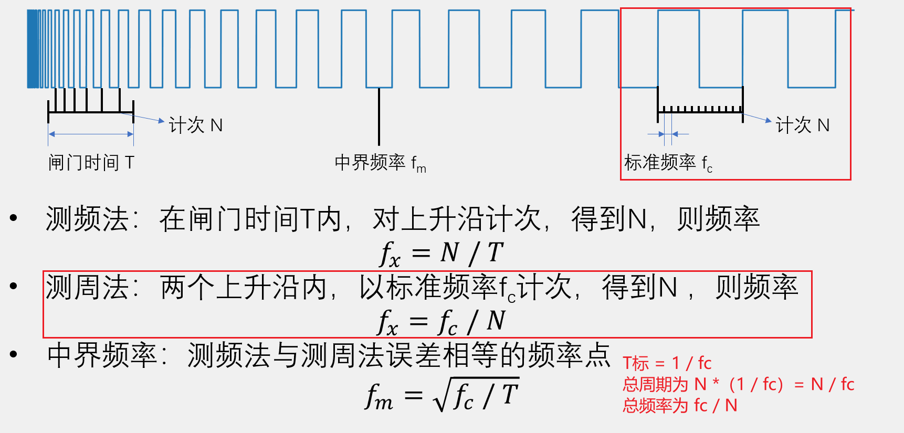	

#### 🤓 输入捕获原理图

> 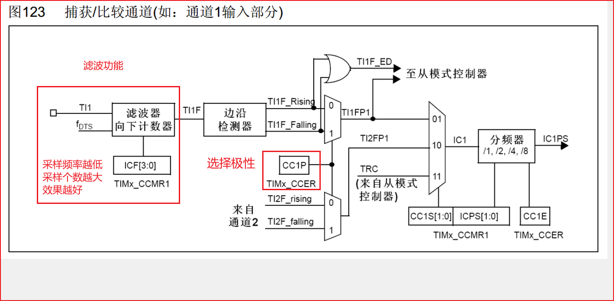

#### 🤓 主从触发源

> 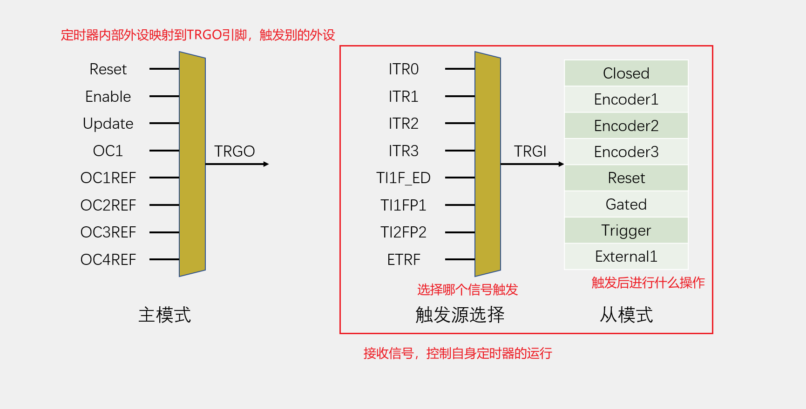

#### 🤓 输入捕获基本流程图

- ***<u>每次上升沿来时，定时器会将不断自增的CNT的值保存在CCR中，然后再触发从模式自动清零CNT，再由时钟频率 / CCR（也就是fc / N），就可以得到频率</u>***

> 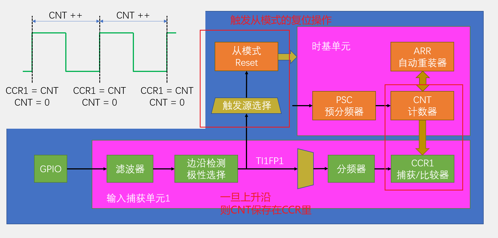

#### 🤓 PWMI模式基本流程图

> 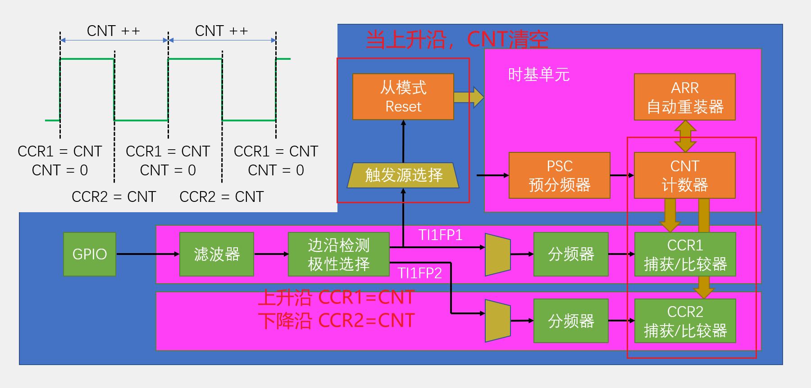

#### 🤓 输入捕获配置常用函数

> 

#### 🤓 输入捕获测频率
``` c
#include "stm32f10x.h"                  // Device header
 
/**
  * 函    数：输入捕获初始化
  * 参    数：无
  * 返 回 值：无
  */
void IC_Init(void)
{
	/*开启时钟*/
	RCC_APB1PeriphClockCmd(RCC_APB1Periph_TIM3, ENABLE);			//开启TIM3的时钟
	RCC_APB2PeriphClockCmd(RCC_APB2Periph_GPIOA, ENABLE);			//开启GPIOA的时钟
	
	/*GPIO初始化*/
	GPIO_InitTypeDef GPIO_InitStructure;
	GPIO_InitStructure.GPIO_Mode = GPIO_Mode_IPU;
	GPIO_InitStructure.GPIO_Pin = GPIO_Pin_6;
	GPIO_InitStructure.GPIO_Speed = GPIO_Speed_50MHz;
	GPIO_Init(GPIOA, &GPIO_InitStructure);							//将PA6引脚初始化为上拉输入
	
	/*配置时钟源*/
	TIM_InternalClockConfig(TIM3);		//选择TIM3为内部时钟，若不调用此函数，TIM默认也为内部时钟
	
	/*时基单元初始化*/
	TIM_TimeBaseInitTypeDef TIM_TimeBaseInitStructure;				//定义结构体变量
	TIM_TimeBaseInitStructure.TIM_ClockDivision = TIM_CKD_DIV1;     //时钟分频，选择不分频，此参数用于配置滤波器时钟，不影响时基单元功能
	TIM_TimeBaseInitStructure.TIM_CounterMode = TIM_CounterMode_Up; //计数器模式，选择向上计数
	TIM_TimeBaseInitStructure.TIM_Period = 65536 - 1;               //计数周期，即ARR的值
	TIM_TimeBaseInitStructure.TIM_Prescaler = 72 - 1;               //预分频器，即PSC的值
	TIM_TimeBaseInitStructure.TIM_RepetitionCounter = 0;            //重复计数器，高级定时器才会用到
	TIM_TimeBaseInit(TIM3, &TIM_TimeBaseInitStructure);             //将结构体变量交给TIM_TimeBaseInit，配置TIM3的时基单元
	
	/*输入捕获初始化*/
	TIM_ICInitTypeDef TIM_ICInitStructure;							//定义结构体变量
	TIM_ICInitStructure.TIM_Channel = TIM_Channel_1;				//选择配置定时器通道1
	TIM_ICInitStructure.TIM_ICFilter = 0xF;							//输入滤波器参数，可以过滤信号抖动
	TIM_ICInitStructure.TIM_ICPolarity = TIM_ICPolarity_Rising;		//极性，选择为上升沿触发捕获
	TIM_ICInitStructure.TIM_ICPrescaler = TIM_ICPSC_DIV1;			//捕获预分频，选择不分频，每次信号都触发捕获
	TIM_ICInitStructure.TIM_ICSelection = TIM_ICSelection_DirectTI;	//输入信号交叉，选择直通，不交叉
	TIM_ICInit(TIM3, &TIM_ICInitStructure);							//将结构体变量交给TIM_ICInit，配置TIM3的输入捕获通道
	
	/*选择触发源及从模式*/
	TIM_SelectInputTrigger(TIM3, TIM_TS_TI1FP1);					//触发源选择TI1FP1
	TIM_SelectSlaveMode(TIM3, TIM_SlaveMode_Reset);					//从模式选择复位
																	//即TI1产生上升沿时，会触发CNT归零
	
	/*TIM使能*/
	TIM_Cmd(TIM3, ENABLE);			//使能TIM3，定时器开始运行
}
 
/**
  * 函    数：获取输入捕获的频率
  * 参    数：无
  * 返 回 值：捕获得到的频率
  */
uint32_t IC_GetFreq(void)
{
	return 1000000 / (TIM_GetCapture1(TIM3) + 1);		//测周法得到频率fx = fc / N，这里不执行+1的操作也可
}
```

#### 🤓 PWMI模式测频率占空比

``` c
#include "stm32f10x.h"                  // Device header
 
/**
  * 函    数：输入捕获初始化
  * 参    数：无
  * 返 回 值：无
  */
void IC_Init(void)
{
	/*开启时钟*/
	RCC_APB1PeriphClockCmd(RCC_APB1Periph_TIM3, ENABLE);			//开启TIM3的时钟
	RCC_APB2PeriphClockCmd(RCC_APB2Periph_GPIOA, ENABLE);			//开启GPIOA的时钟
	
	/*GPIO初始化*/
	GPIO_InitTypeDef GPIO_InitStructure;
	GPIO_InitStructure.GPIO_Mode = GPIO_Mode_IPU;
	GPIO_InitStructure.GPIO_Pin = GPIO_Pin_6;
	GPIO_InitStructure.GPIO_Speed = GPIO_Speed_50MHz;
	GPIO_Init(GPIOA, &GPIO_InitStructure);							//将PA6引脚初始化为上拉输入
	
	/*配置时钟源*/
	TIM_InternalClockConfig(TIM3);		//选择TIM3为内部时钟，若不调用此函数，TIM默认也为内部时钟
	
	/*时基单元初始化*/
	TIM_TimeBaseInitTypeDef TIM_TimeBaseInitStructure;				//定义结构体变量
	TIM_TimeBaseInitStructure.TIM_ClockDivision = TIM_CKD_DIV1;     //时钟分频，选择不分频，此参数用于配置滤波器时钟，不影响时基单元功能
	TIM_TimeBaseInitStructure.TIM_CounterMode = TIM_CounterMode_Up; //计数器模式，选择向上计数
	TIM_TimeBaseInitStructure.TIM_Period = 65536 - 1;               //计数周期，即ARR的值
	TIM_TimeBaseInitStructure.TIM_Prescaler = 72 - 1;               //预分频器，即PSC的值
	TIM_TimeBaseInitStructure.TIM_RepetitionCounter = 0;            //重复计数器，高级定时器才会用到
	TIM_TimeBaseInit(TIM3, &TIM_TimeBaseInitStructure);             //将结构体变量交给TIM_TimeBaseInit，配置TIM3的时基单元
	
	/*PWMI模式初始化*/
	TIM_ICInitTypeDef TIM_ICInitStructure;							//定义结构体变量
	TIM_ICInitStructure.TIM_Channel = TIM_Channel_1;				//选择配置定时器通道1
	TIM_ICInitStructure.TIM_ICFilter = 0xF;							//输入滤波器参数，可以过滤信号抖动
	TIM_ICInitStructure.TIM_ICPolarity = TIM_ICPolarity_Rising;		//极性，选择为上升沿触发捕获
	TIM_ICInitStructure.TIM_ICPrescaler = TIM_ICPSC_DIV1;			//捕获预分频，选择不分频，每次信号都触发捕获
	TIM_ICInitStructure.TIM_ICSelection = TIM_ICSelection_DirectTI;	//输入信号交叉，选择直通，不交叉
	TIM_PWMIConfig(TIM3, &TIM_ICInitStructure);						//将结构体变量交给TIM_PWMIConfig，配置TIM3的输入捕获通道
																	//此函数同时会把另一个通道配置为相反的配置，实现PWMI模式
 
	/*选择触发源及从模式*/
	TIM_SelectInputTrigger(TIM3, TIM_TS_TI1FP1);					//触发源选择TI1FP1
	TIM_SelectSlaveMode(TIM3, TIM_SlaveMode_Reset);					//从模式选择复位
																	//即TI1产生上升沿时，会触发CNT归零
	
	/*TIM使能*/
	TIM_Cmd(TIM3, ENABLE);			//使能TIM3，定时器开始运行
}
 
/**
  * 函    数：获取输入捕获的频率
  * 参    数：无
  * 返 回 值：捕获得到的频率
  */
uint32_t IC_GetFreq(void)
{
	return 1000000 / (TIM_GetCapture1(TIM3) + 1);		//测周法得到频率fx = fc / N，这里不执行+1的操作也可
}
 
/**
  * 函    数：获取输入捕获的占空比
  * 参    数：无
  * 返 回 值：捕获得到的占空比
  */
uint32_t IC_GetDuty(void)
{
	return (TIM_GetCapture2(TIM3) + 1) * 100 / (TIM_GetCapture1(TIM3) + 1);	//占空比Duty = CCR2 / CCR1 * 100，这里不执行+1的操作也可
}
```

## 🔌 串口协议

#### 🔌 关于通信协议

| 名称   | 引脚               | 双工   | 时钟   | 电平   | 设备   |
|--------|--------------------|--------|--------|--------|--------|
| USART  | TX、RX            | 全双工 | 异步   | 单端   | 点对点 |
| I2C    | SCL、SDA          | 半双工 | 同步   | 单端   | 多设备 |
| SPI    | SCLK、MOSI、MISO、CS | 全双工 | 同步   | 单端   | 多设备 |
| CAN    | CAN_H、CAN_L      | 半双工 | 异步   | 差分   | 多设备 |
| USB    | DP、DM            | 半双工 | 异步   | 差分   | 点对点 |

#### 🔌 串口协议简介

- ***<u>UART异步收发</u>***，USART同步收发
- 串口协议可以实现两个设备之间的数据通信
- 可以应用于***<u>单片机与电脑、单片机与单片机、单片机与传感器</u>***等多种设备之间的数据通信
- STM32F103C8T6 USART资源： USART1、 USART2、 USART3

#### 🔌 串口协议接线与电平标准

- 简单双向串口通信有两根通信线，***<u>发送端TX和接收端RX</u>***
- ***<u>TX与RX要交叉连接</u>***
- 当只需单向的数据传输时，可以只接一根通信线
- 当电平标准不一致时，需要加电平转换芯片

> 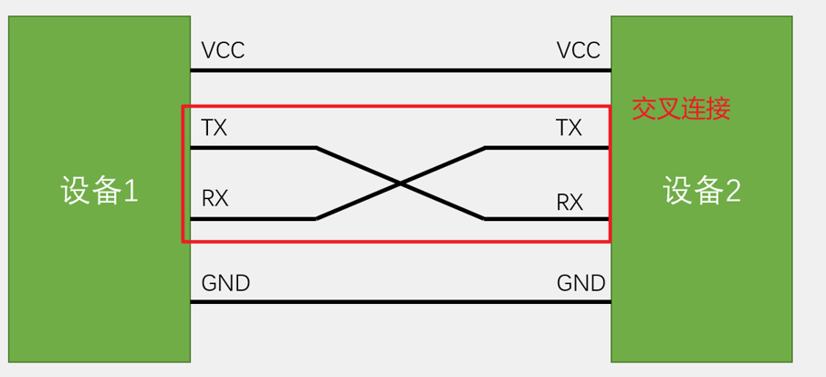

> 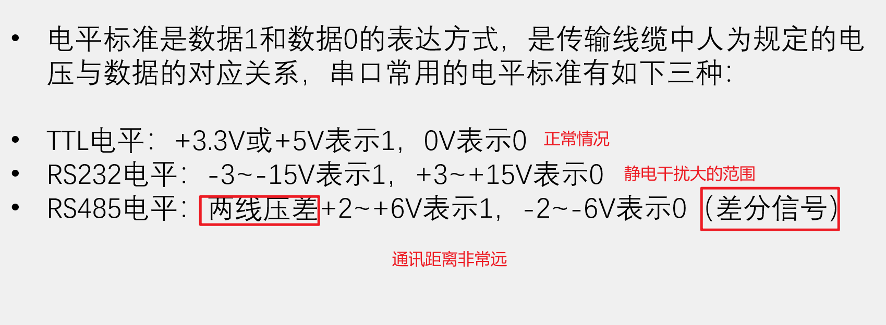

#### 🔌 串口协议每一位的参数及时序

- 波特率：串口通信的速率，***<u>单位为符号，一个符号可以包含多个比特（位）</u>***，两个设备必须设置***<u>相同的波特率</u>***才能通信
- 起始位：标志一个数据帧的开始，***<u>固定为低电平</u>***
- 数据位：数据帧的有效载荷，1为高电平，0为低电平，***<u>低位先行</u>***，也就是***<u>0000 0001低位1先传输</u>***，数据位长度可以是8位或9位
- 校验位：用于数据验证，***<u>如果为奇校验则是数据1的个数为奇数</u>***
- 停止位：用于数据帧间隔，***<u>固定为高电平</u>***，停止位长度可以是0.5位，1位、1.5位或2位

> 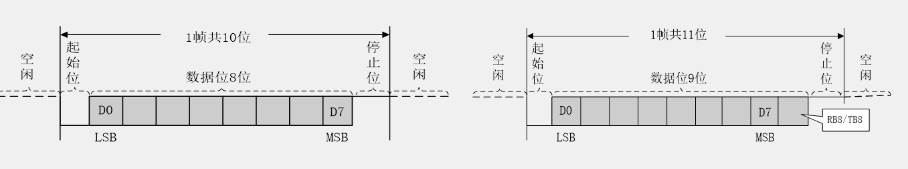

> 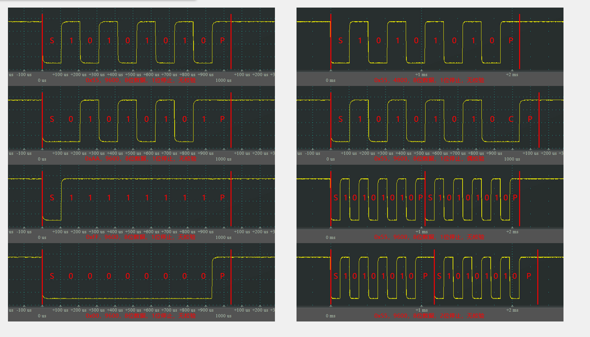

#### 🔌 串口协议原理图

> 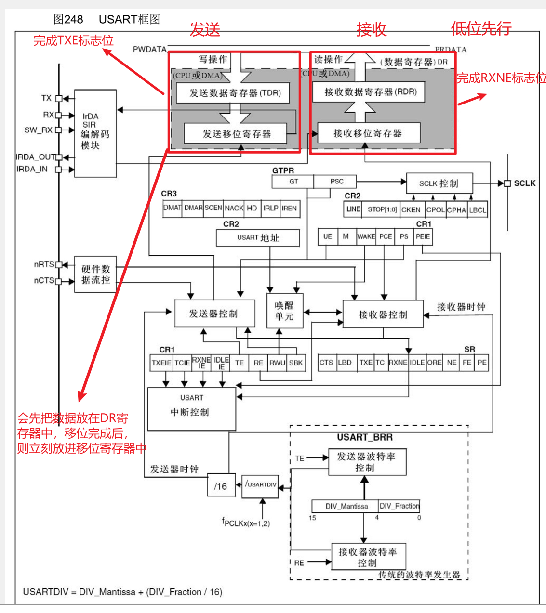

#### 🔌 串口协议基本流程图

> 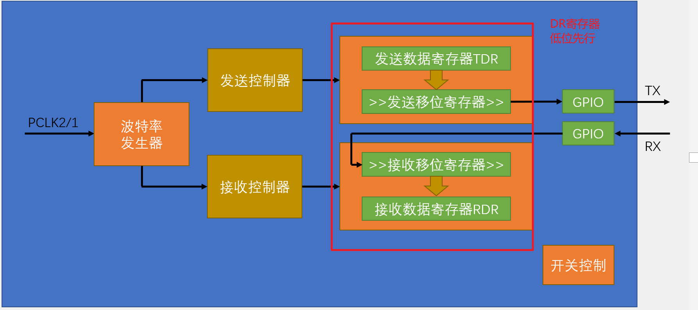

#### 🔌 起始位，数据为的检测，波特率发生器（不那么重要）

> 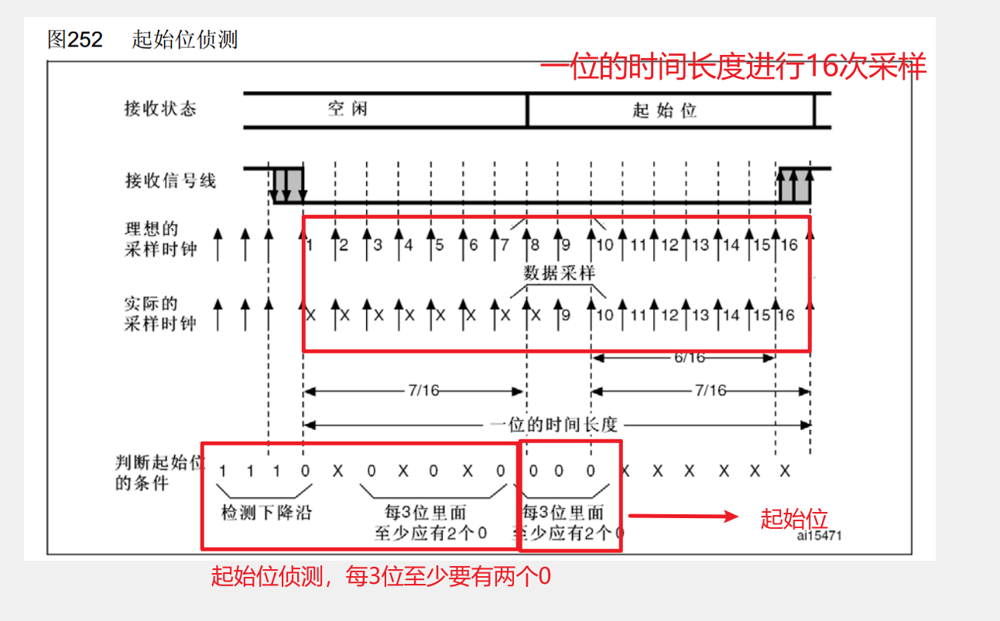

> 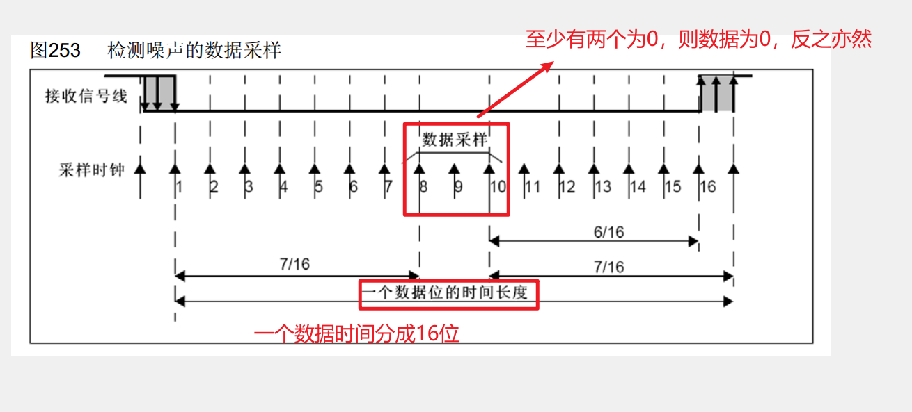

> 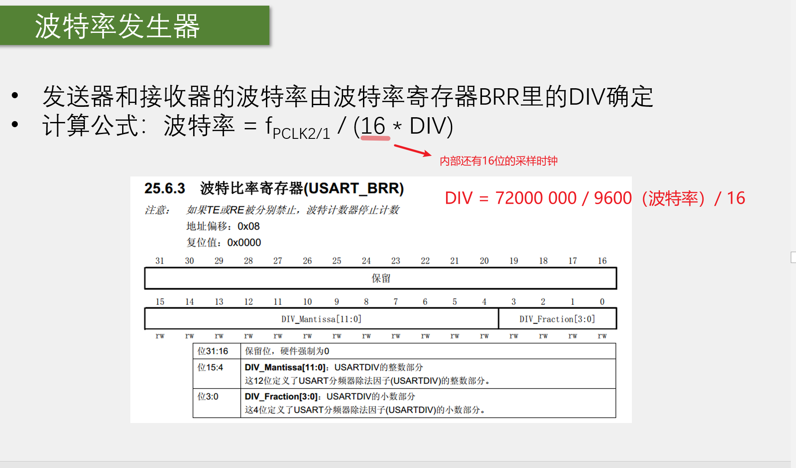

#### 🔌 串口协议配置常用函数

> 

#### 🔌 print函数使用前提配置

> 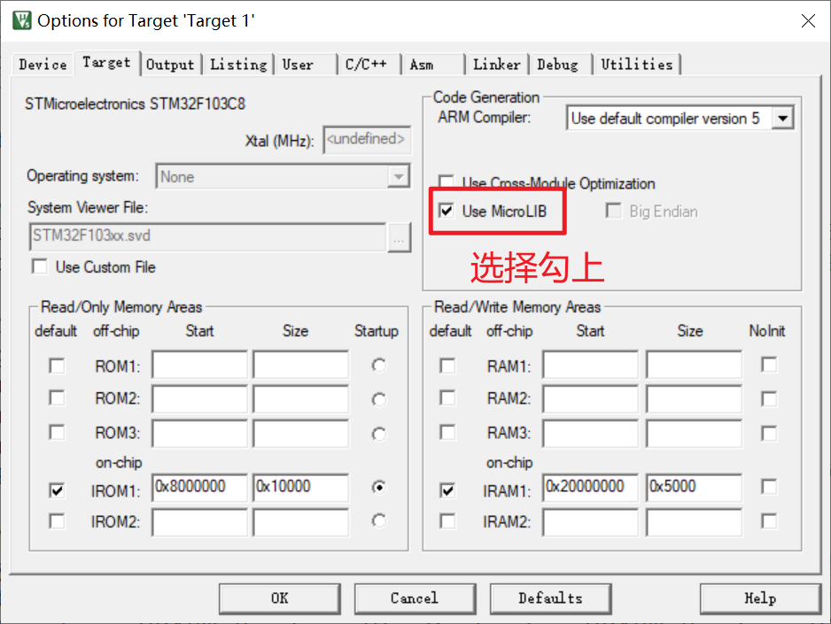

> 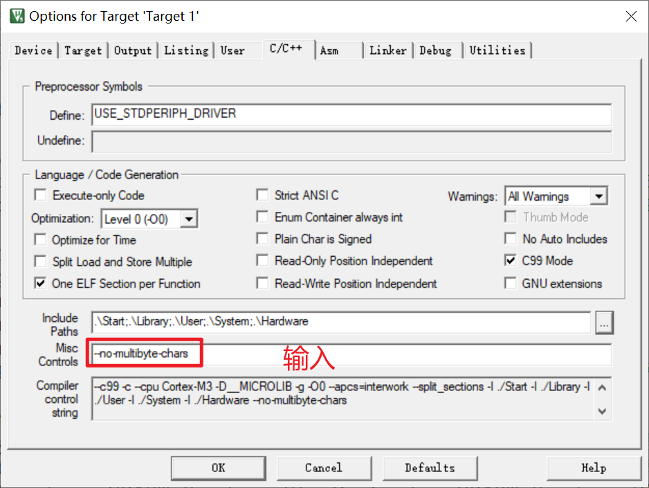
>
> --no-multibyte-chars

#### 🔌 CRC校验

[关于CRC校验的文章，以及例子](https://github.com/Amuvin/STM32-CRC-Modbus)

#### 🔌 Modbus协议通用串口通信.c文件

``` c
#include "Serial.h"

// 定义一个全局变量来存储接收到的数据
static DataStruct data;

/**
  * 函    数：串口初始化
  * 参    数：无
  * 返 回 值：无
  */
void Serial_Init(void)
{
	/*开启时钟*/
	RCC_APB2PeriphClockCmd(RCC_APB2Periph_USART1, ENABLE);	//开启USART1的时钟
	RCC_APB2PeriphClockCmd(RCC_APB2Periph_GPIOA, ENABLE);	//开启GPIOA的时钟
	
	/*GPIO初始化*/
	GPIO_InitTypeDef GPIO_InitStructure;
	GPIO_InitStructure.GPIO_Mode = GPIO_Mode_AF_PP;
	GPIO_InitStructure.GPIO_Pin = GPIO_Pin_9;
	GPIO_InitStructure.GPIO_Speed = GPIO_Speed_50MHz;
	GPIO_Init(GPIOA, &GPIO_InitStructure);					//将PA9引脚初始化为复用推挽输出
	
	GPIO_InitStructure.GPIO_Mode = GPIO_Mode_IPU;
	GPIO_InitStructure.GPIO_Pin = GPIO_Pin_10;
	GPIO_InitStructure.GPIO_Speed = GPIO_Speed_50MHz;
	GPIO_Init(GPIOA, &GPIO_InitStructure);					//将PA10引脚初始化为上拉输入
	
	/*USART初始化*/
	USART_InitTypeDef USART_InitStructure;					//定义结构体变量
	USART_InitStructure.USART_BaudRate = 9600;				//波特率
	USART_InitStructure.USART_HardwareFlowControl = USART_HardwareFlowControl_None;	//硬件流控制，不需要
	USART_InitStructure.USART_Mode = USART_Mode_Tx | USART_Mode_Rx;	//模式，发送模式和接收模式均选择
	USART_InitStructure.USART_Parity = USART_Parity_No;		//奇偶校验，不需要
	USART_InitStructure.USART_StopBits = USART_StopBits_1;	//停止位，选择1位
	USART_InitStructure.USART_WordLength = USART_WordLength_8b;		//字长，选择8位
	USART_Init(USART1, &USART_InitStructure);				//将结构体变量交给USART_Init，配置USART1
	
	/*中断输出配置*/
	USART_ITConfig(USART1, USART_IT_RXNE, ENABLE);			//开启串口接收数据的中断
	
	/*NVIC中断分组*/
	NVIC_PriorityGroupConfig(NVIC_PriorityGroup_2);			//配置NVIC为分组2
	
	/*NVIC配置*/
	NVIC_InitTypeDef NVIC_InitStructure;					//定义结构体变量
	NVIC_InitStructure.NVIC_IRQChannel = USART1_IRQn;		//选择配置NVIC的USART1线
	NVIC_InitStructure.NVIC_IRQChannelCmd = ENABLE;			//指定NVIC线路使能
	NVIC_InitStructure.NVIC_IRQChannelPreemptionPriority = 1;		//指定NVIC线路的抢占优先级为1
	NVIC_InitStructure.NVIC_IRQChannelSubPriority = 1;		//指定NVIC线路的响应优先级为1
	NVIC_Init(&NVIC_InitStructure);							//将结构体变量交给NVIC_Init，配置NVIC外设
	
	/*USART使能*/
	USART_Cmd(USART1, ENABLE);								//使能USART1，串口开始运行
}

/**
  * 函    数：串口发送一个字节
  * 参    数：Byte 要发送的一个字节
  * 返 回 值：无
  */
void Serial_SendByte(uint8_t Byte)
{
	USART_SendData(USART1, Byte);		//将字节数据写入数据寄存器，写入后USART自动生成时序波形
	while (USART_GetFlagStatus(USART1, USART_FLAG_TXE) == RESET);	//等待发送完成
	/*下次写入数据寄存器会自动清除发送完成标志位，故此循环后，无需清除标志位*/
}

/**
  * 函    数：串口发送一个数组
  * 参    数：Array 要发送数组的首地址
  * 参    数：Length 要发送数组的长度
  * 返 回 值：无
  */
void Serial_SendArray(uint8_t *Array, uint16_t Length)
{
	uint16_t i;
	for (i = 0; i < Length; i ++)		//遍历数组
	{
		Serial_SendByte(Array[i]);		//依次调用Serial_SendByte发送每个字节数据
	}
}

/**
  * 函    数：串口发送一个字符串
  * 参    数：String 要发送字符串的首地址
  * 返 回 值：无
  */
void Serial_SendString(char *String)
{
	uint8_t i;
	for (i = 0; String[i] != '\0'; i ++)//遍历字符数组（字符串），遇到字符串结束标志位后停止
	{
		Serial_SendByte(String[i]);		//依次调用Serial_SendByte发送每个字节数据
	}
}

/**
  * 函    数：使用printf需要重定向的底层函数
  * 参    数：保持原始格式即可，无需变动
  * 返 回 值：保持原始格式即可，无需变动
  */
int fputc(int ch, FILE *f)
{
	Serial_SendByte(ch);			//将printf的底层重定向到自己的发送字节函数
	return ch;
}

/**
  * 函    数：自己封装的prinf函数
  * 参    数：format 格式化字符串
  * 参    数：... 可变的参数列表
  * 返 回 值：无
  */
void Serial_Printf(char *format, ...)
{
	char String[100];				//定义字符数组
	va_list arg;					//定义可变参数列表数据类型的变量arg
	va_start(arg, format);			//从format开始，接收参数列表到arg变量
	vsprintf(String, format, arg);	//使用vsprintf打印格式化字符串和参数列表到字符数组中
	va_end(arg);					//结束变量arg
	Serial_SendString(String);		//串口发送字符数组（字符串）
}

/**
  * 函    数：计算CRC16/MODBUS校验码
  * 参    数：data 要校验的数据首地址
  * 参    数：len 要校验的数据长度
  * 返 回 值：返回CRC16校验值
  * 注意事项：多项式：x^16 + x^15 + x^2 + 1 (即 0x8005)
  * 		 初始值为：0xFFFF
  * 		 
  */
uint16_t Serial_CRC16_Check(const uint8_t *data,uint8_t len)
{
	uint16_t CRC16 = 0xFFFF;	 // 初始化CRC

	for (uint8_t i = 0; i < len; i ++)	// 遍历每一个输入数据字节
	{
		// 将当前数据字节与CRC寄存器的高8位进行异或
        // 这一步相当于把新的8位数据“喂”给CRC计算引擎，整合之前所有数据的CRC值
		CRC16 ^= (data[i] << 8);

		// 由于数据data的位数为8位，需要计算8次
		for (uint8_t bit = 0; bit < 8; bit ++)
		{
			if (CRC16 & 0x8000) // 检查数据最高位是否为1
			{
				CRC16 <<= 1;	// 如果最高位是1，CRC寄存器先左移一位 (丢弃最高位)
								// 由于多项式生成的除数为1 1000 0000 0000 0101为17位
								// 而程序除数1000 0000 0000 0101只有16位，相比于理论除数少了一位
								// 所以得从被除数补回来，抵消这个少了一位除数的影响

				CRC16 ^= 0x8005;// 然后进行异或操作，算出CRC值
			} 
			else 
			{
				CRC16 <<= 1;	// 没有找到首位为1，继续移动寻找
			}
		}
	}

	return CRC16;
}

/**
  * 函    数：发送数据帧
  * 参    数：cmd 命令字节
  * 参    数：datas 数据数组首地址
  * 参    数：len 总字节长度
  * 返 回 值：无
  */
void Serial_Send_Cmd_Data(uint8_t cmd,const uint8_t *datas,uint8_t len)
{
    uint8_t buf[300],i,cnt=0;
    uint16_t crc16;
    buf[cnt++] = 0xA5;
    buf[cnt++] = 0x5A;
    buf[cnt++] = len;
    buf[cnt++] = cmd;
    for(i=0;i<len;i++)
    {
        buf[cnt++] = datas[i];
    }
    crc16 = Serial_CRC16_Check(buf,len+4);
    buf[cnt++] = crc16>>8;
    buf[cnt++] = crc16&0xFF;
    buf[cnt++] = 0xFF;
    Serial_SendArray(buf,cnt);// 调用数据帧发送函数将打包好的数据帧发送出去
}

/**
  * 函    数：发送结构体
  * 参    数：cmd 命令
  * 参    数：data 指向要发送的DataStruct结构体的指针
  * 返 回 值：无
  * 注意事项：此函数会将结构体格式化为字符串，并打包成数据帧发送
  */
void Serial_SendStructData(uint8_t cmd, DataStruct *data)
{
	uint8_t buffer[300];
	int len = snprintf((char *)buffer, sizeof(buffer), "keyNum:%d,floatData:%4.2f,intData:%d",
					  data->keyNum, data->floatData, data->intData);

	Serial_Send_Cmd_Data(cmd, buffer, len); // 使用指定命令字发送数据帧
}

/**
  * 函    数：根据命令解析函数
  * 参    数：cmd 命令字节
  * 参    数：datas 数据数组首地址
  * 参    数：len 总字节长度
  * 返 回 值：无
  * 注意事项：根据需要处理数据
  */
void Serial_DataAnalysis(uint8_t cmd,const uint8_t *datas,uint8_t len)
{
	switch(cmd)
	{
		case 0x01:
			sscanf((const char *)datas, "keyNum:%hhu,floatData:%f,intData:%d",
				   &data.keyNum,
				   &data.floatData,
				   &data.intData);
			break;
		case 0x02:

			break;
		default:
			break;
	}
}

/**
  * 函    数：返回接收到的数据结构体
  * 参    数：无
  * 返 回 值：返回接收到的数据结构体
  */
DataStruct Serial_GetReceivedStructData(void)
{
	return data;
}

/**
  * 函    数：串口接收状态机
  * 参    数：bytedata 接收到的一个字节数据
  * 返 回 值：无
  * 注意事项：此函数为状态机，接收数据后自动调用
  */
void Serial_Receive(uint8_t bytedata)
{
	static uint8_t state = 0;	// 状态变量初始化为0 在函数中必须为静态变量
	static uint8_t cnt = 0;  	// 计算元素的个数
	static uint8_t cmd, *data_ptr;	// 存储命令,存储数据的指针
	static uint8_t Buf[300], len;	// 储存接收的信号，数据的长度，用于CRC校验
	static uint16_t crc16;		// 存储CRC校验值
	
	switch (state)
	{
	case 0:
		if (bytedata == 0xA5)
		{
			cnt = 0;
			Buf[cnt++] = bytedata;
			state = 1; // 切换到另一个包头状态
		}
		break;

	case 1:
		if (bytedata == 0x5A)
		{
			Buf[cnt++] = bytedata;
			state = 2; // 切换到长度接收状态
		}
		else
		{
			state = 0; // 如果不是包头，回到初始状态
		}
		break;

	case 2:
		Buf[cnt++] = bytedata;
		len = bytedata;
		state = 3; // 切换到命令接收状态
		break;

	case 3:
		Buf[cnt++] = bytedata;
		cmd = bytedata;
		data_ptr = &Buf[cnt];// 记录数据指针首地址
		state = 4; // 切换到数据接收状态
		if (len == 0) state = 5;// 数据字节长度为0则跳过数据接收状态
		break;
	
	case 4:
		Buf[cnt++] = bytedata;
		if (data_ptr + len == &Buf[cnt]) // 检查是否接收完所有数据字节
		{
			state = 5; // 切换到CRC接收状态
		}
		break;

	case 5:
		crc16 = bytedata << 8; // 高字节
		state = 6; // 切换到CRC低字节接收状态
		break;

	case 6:
		crc16 |= bytedata; // 低字节
		if (crc16 == Serial_CRC16_Check(Buf, len + 4)) // 校验CRC
		{
			state = 7; // 切换到数据帧接收完成状态
		}
		else
		{
			state = 0; // CRC校验失败，回到初始状态
		}
		break;

	case 7:
		if (bytedata == 0xFF)
		{
			Serial_DataAnalysis(cmd, data_ptr, len);	// 调用数据解析函数处理接收到的数据
		}
		state = 0; // 无论成功与否，回到初始状态准备接收下一个数据帧
		break;
	default:
		state = 0;
		break;
	}
}

/**
  * 函    数：USART1中断函数
  * 参    数：无
  * 返 回 值：无
  * 注意事项：此函数为中断函数，无需调用，中断触发后自动执行
  *           函数名为预留的指定名称，可以从启动文件复制
  *           请确保函数名正确，不能有任何差异，否则中断函数将不能进入
  */
void USART1_IRQHandler(void)
{
	if (USART_GetITStatus(USART1, USART_IT_RXNE) == SET)		//判断是否是USART1的接收事件触发的中断
	{
		static uint8_t RxData;
        RxData = USART_ReceiveData(USART1);

		Serial_Receive(RxData);		//调用接收数据解析函数，传入接收到的字节数据
		
		USART_ClearITPendingBit(USART1, USART_IT_RXNE);		//清除标志位
	}
}
```

#### 🔌 Modbus协议通用串口通信.h文件

``` c
#ifndef __SERIAL_H
#define __SERIAL_H

#include "stm32f10x.h"                  // Device header
#include <stdio.h>
#include <stdarg.h>

// 定义一个结构体来存储数据
typedef struct {
    uint8_t keyNum;     // 按键键码
    float floatData;    // 浮点数数据
    int intData;        // 整数数据
} DataStruct;

void Serial_Init(void);
void Serial_Printf(char *format, ...);

void Serial_SendStructData(uint8_t cmd, DataStruct *data);
DataStruct Serial_GetReceivedStructData(void);

#endif
```

## ✉ IIC通信协议

#### ✉ IIC通信简介

- I2C（Inter-Integrated Circuit）总线，又称为IIC总线
- 两根通信线：***<u>SCL（时钟线）、SDA（数据线）</u>***
- 高位先行
- 同步，半双工
- 带数据应答位
- 一主多从、多主多从

#### ✉ IIC硬件电路

- 所有I2C设备的SCL连在一起，SDA连在一起
- 设备的SCL和SDA均要配置成开漏输出模式
- SCL和SDA各添加一个上拉电阻，阻值一般为4.7KΩ左右

> 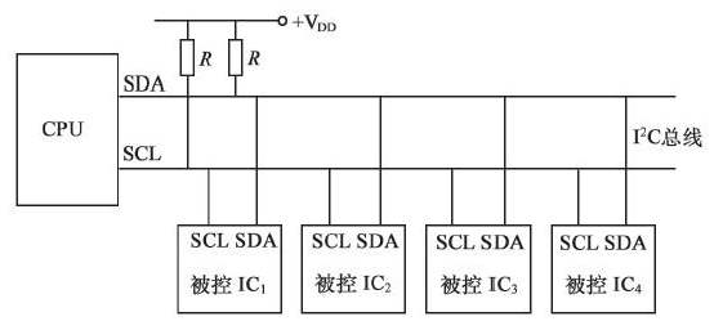

#### ✉ IIC时序基本单元

- IIC时序基本单元分为：***<u>起始条件、终止条件、发送一个字节、接收一个字节、发送应答，接收应答</u>***

> 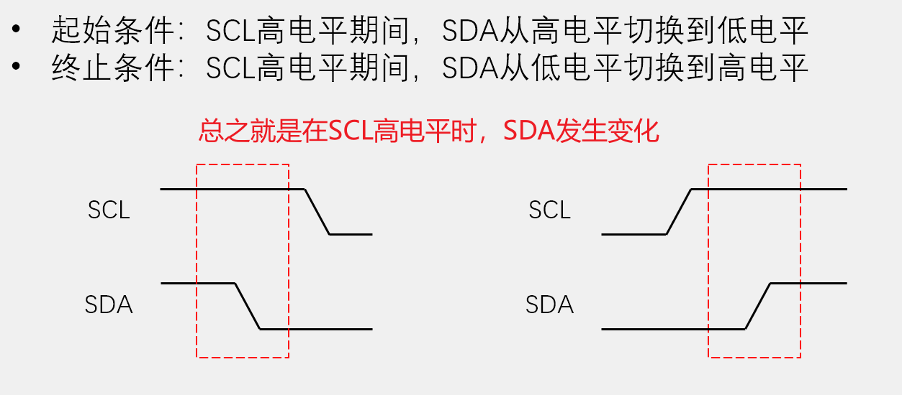

> 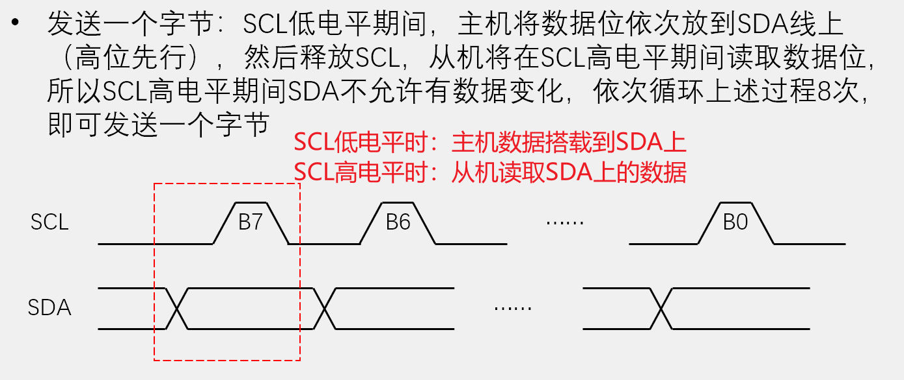

> 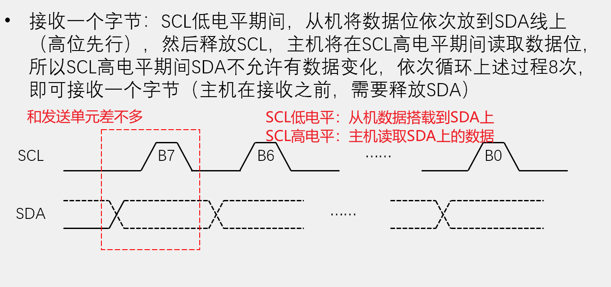

> 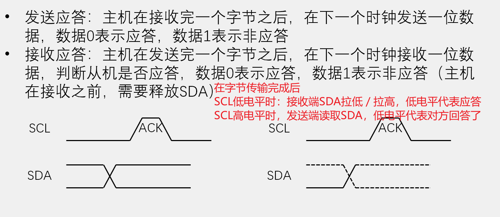

#### ✉ IIC指定地址写/读时序

##### ✉ IIC指定地址写时序

- 起始位 + 指定从机（写操作） + 应答位 + 指定地址 + 应答位 + 写入的数据 + 应答位 + 终止位

> 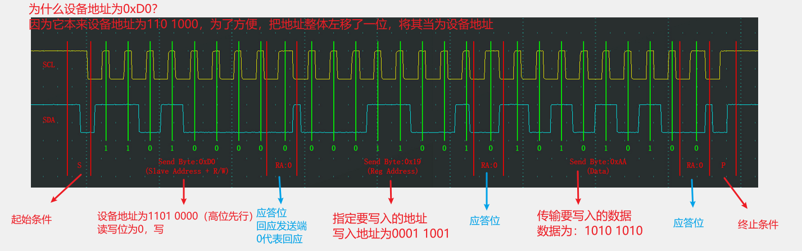

##### ✉ IIC指定地址读时序

- 起始位 + 指定从机（写操作） + 应答位 + 指定地址 + 应答位 + 起始位 + 指定从机（读操作） + 应答位 + 读取的数据 + 应答位 + 终止位

> 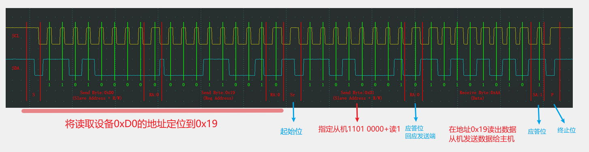