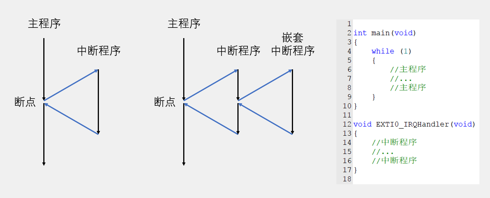
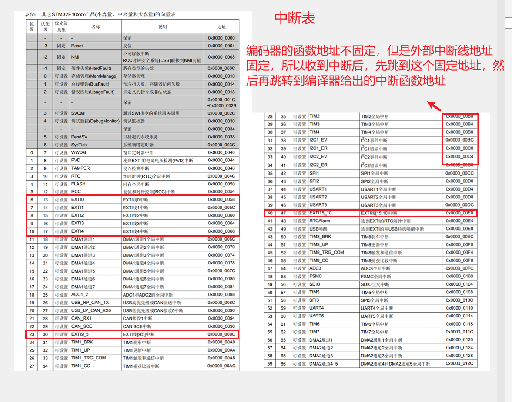
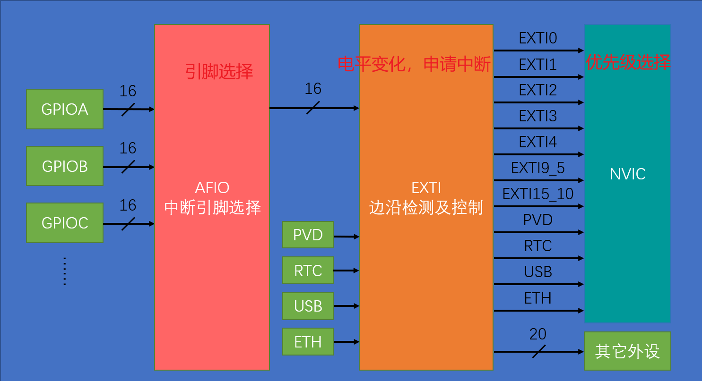
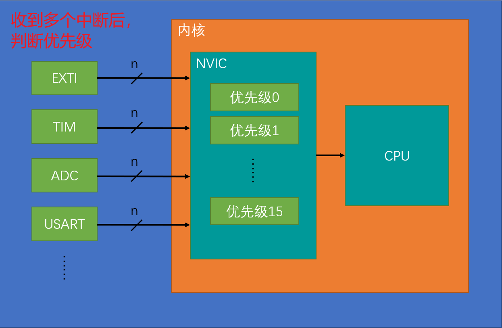

<h1 align="center"> 📒 STM32F103知识整理</h1> 

## 📃 前言

* 读者可以根据自己的需要进行页面的跳转学习
* 每个知识点的最后都有**相对应的例子**
* 格式为：**先说明理论，后函数，最后例子**
* 让我们开始学习吧 🤓

## 🖊 笔记总览

> [00 - STM32F103引脚定义](# 📐 STM32F103引脚定义)
>
> [01 - GPIO控制](# 🎓 GPIO控制)
>
> [02 - 外部中断控制](# 引脚定义)
>
> [03 - TIM定时中断](# 引脚定义)
>
> [04 - 编码器接口](# 引脚定义)
>
> [05 - PWM输出](# 引脚定义)
>
> [06 - IC输入捕获](# 引脚定义)
>
> [06 - UART串口协议](# 引脚定义)
>
> [07 - IIC通信协议](# 引脚定义)
>
> [08 - SPI通信协议](# 引脚定义)
>
> [09 - ADC模数转换](# 引脚定义)
>
> [10 - DMA数据搬运](# 引脚定义)

## 📐 STM32F103引脚定义

> 

## 🎓 GPIO控制

#### ✏ GPIO简介

- GPIO（General Purpose Input Output）通用输入输出口
- 可配置为8种输入输出模式
- 引脚电平：**0V~3.3V**，部分引脚可容忍5V
- 输出模式下可控制端口输出高低电平，用以驱动LED、控制蜂鸣器、模拟通信协议输出时序等
- 输入模式下可读取端口的高低电平或电压，用于读取按键输入、外接模块电平信号输入、ADC电压采集、模拟通信协议接收数据等

#### ✏ GPIO基本结构

- GPIO挂载在**APB2**总线上

> 

- GPIO基本运行结构框图

>

#### ✏ GPIO模式

| 模式名称       | 性质       | 特征                                     |
|----------------|------------|------------------------------------------|
| 浮空输入       | 数字输入   | 可读取引脚电平，若引脚悬空，则电平不确定 |
| 上拉输入       | 数字输入   | 可读取引脚电平，内部连接上拉电阻，悬空时默认高电平 |
| 下拉输入       | 数字输入   | 可读取引脚电平，内部连接下拉电阻，悬空时默认低电平 |
| 模拟输入       | 模拟输入   | GPIO无效，引脚直接接入内部ADC            |
| 开漏输出       | 数字输出   | 可输出引脚电平，高电平为高阻态，低电平接VSS |
| 推挽输出       | 数字输出   | 可输出引脚电平，高电平接VDD，低电平接VSS |
| 复用开漏输出   | 数字输出   | 由片上外设控制，高电平为高阻态，低电平接VSS |
| 复用推挽输出   | 数字输出   | 由片上外设控制，高电平接VDD，低电平接VSS |

>

#### ✏ GPIO配置常用函数

> 

> 

#### ✏ 点亮一个LED灯

``` c
#include "stm32f10x.h"                  // Device header

/**
  * 函    数：LED初始化
  * 参    数：无
  * 返 回 值：无
  */
void LED_Init(void)
{
	/*开启时钟*/
	RCC_APB2PeriphClockCmd(RCC_APB2Periph_GPIOA, ENABLE);		//开启GPIOA的时钟
	
	/*GPIO初始化*/
	GPIO_InitTypeDef GPIO_InitStructure;
	GPIO_InitStructure.GPIO_Mode = GPIO_Mode_Out_PP;
	GPIO_InitStructure.GPIO_Pin = GPIO_Pin_1;
	GPIO_InitStructure.GPIO_Speed = GPIO_Speed_50MHz;
	GPIO_Init(GPIOA, &GPIO_InitStructure);						//将PA1引脚初始化为推挽输出
	
	/*设置GPIO初始化后的默认电平*/
	GPIO_SetBits(GPIOA, GPIO_Pin_1);				//设置PA1引脚为高电平
}

/**
  * 函    数：LED开启
  * 参    数：无
  * 返 回 值：无
  */
void LED_ON(void)
{
	GPIO_ResetBits(GPIOA, GPIO_Pin_1);		//设置PA1引脚为低电平
}

/**
  * 函    数：LED关闭
  * 参    数：无
  * 返 回 值：无
  */
void LED_OFF(void)
{
	GPIO_SetBits(GPIOA, GPIO_Pin_1);		//设置PA1引脚为高电平
}
```

## 😎 外部中断控制

#### 😎 中断系统

- **中断：**在主程序运行过程中，出现了特定的中断触发条件（中断源），使得CPU暂停当前正在运行的程序，转而去处理中断程序，处理完成后又返回原来被暂停的位置继续运行，也就是说***<u>发生事件后跳转到对应的程序执行完回来</u>***。
- **中断优先级：**当有多个中断源同时申请中断时，CPU会根据中断源的轻重缓急进行裁决，优先响应更加紧急的中断源，也就是***<u>排队</u>***。
- **中断嵌套：**当一个中断程序正在运行时，又有新的更高优先级的中断源申请中断，CPU再次暂停当前中断程序，转而去处理新的中断程序，处理完成后依次进行返回，也就是***<u>可以打断函数的中断，优先执行</u>***。

> 

#### 😎 STM32F103中断

- ***<u>68</u>***个可屏蔽中断通道，包含EXTI、TIM、ADC、USART、SPI、I2C、RTC等多个外设
- 使用NVIC统一管理中断，每个中断通道都拥有***<u>16</u>***个可编程的优先等级，可对优先级进行分组，进一步设置抢占优先级和响应优先级，也就是***<u>NVIC控制中断优先级</u>***。

> 

#### 😎 外部中断触发顺序

- AFIO为***中断引角选择***，主要用于处理***引脚复用***之类的情况

- EXTI为***申请中断***，就像***学生举手打报告说我要做某件事一样***，向NVIC说明要进行中断了

- NVIC为***处理中断申请***，就像***秘书处理一些申请，把申请按照紧急程度排序一样***，用于跟CPU说你需要处理什么事情，而***CPU只需要埋头苦干***😭就可以

  > 

#### 😎 NVIC中断优先级选择

- NVIC的中断优先级由优先级寄存器的***<u>4位（0~15）</u>***决定，这4位可以进行切分，分为高n位的抢占优先级和低4-n位的响应优先级

- 抢占优先级高的可以中断嵌套，响应优先级高的可以优先排队，抢占优先级和响应优先级均相同的按中断号排队

| 分组方式 | 抢占优先级（插队） | 响应优先级（排队） |
| :------: | :--------: | :--------: |
|  分组0   | 0位, 取值为0 | 4位, 取值为0~15 |
|  分组1   | 1位, 取值为0~1 | 3位, 取值为0~7 |
|  分组2   | 2位, 取值为0~3 | 2位, 取值为0~3 |
|  分组3   | 3位, 取值为0~7 | 1位, 取值为0~1 |
|  分组4   | 4位, 取值为0~15 | 0位, 取值为0 |

> 

#### 😎 EXTI外部中断

- EXTI（Extern Interrupt）外部中断
- EXTI可以***<u>检测引脚电平变化，申请中断</u>***
- 支持的触发方式：上升沿/下降沿/双边沿/软件触发
- 支持的GPIO口：所有GPIO口，但***<u>相同的Pin不能同时触发中断</u>***，比如***<u>PA0和PB0</u>***就不行
- 通道数：16个GPIO_Pin，外加PVD输出、RTC闹钟、USB唤醒、以太网唤醒
- 触发响应方式：中断响应/事件响应，事件响应就是不进去CPU，直接触发ADC/DMA
