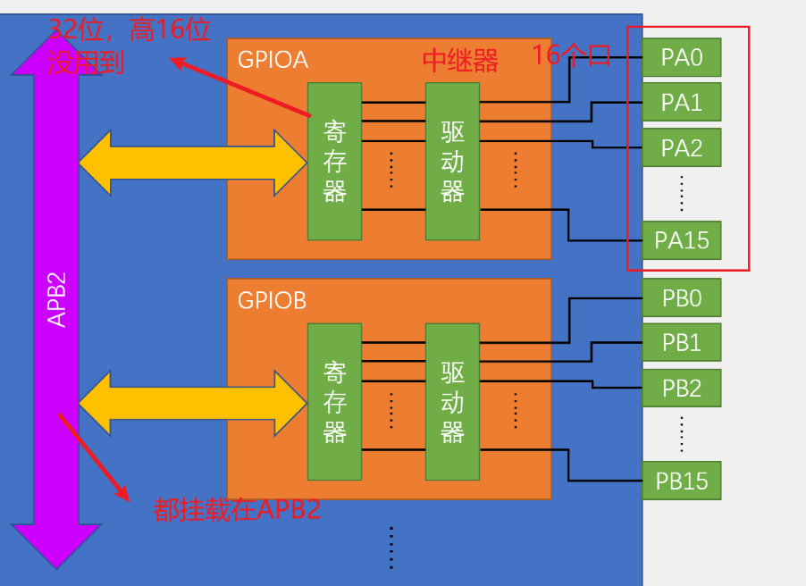
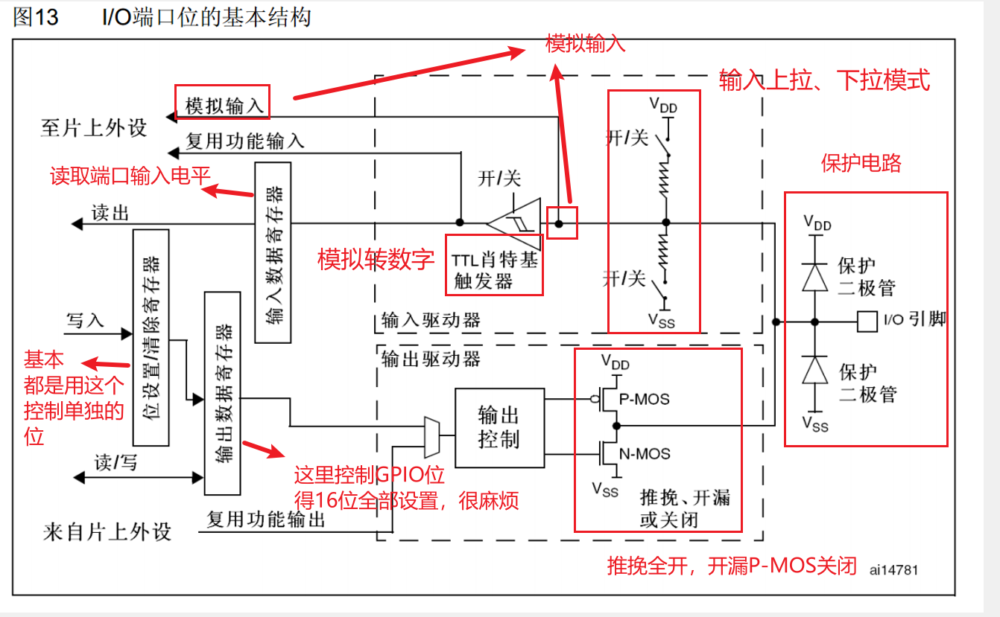

<h1 align="center"> 📒 STM32F103知识整理</h1> 

## 📃 前言

* 读者可以根据自己的需要进行页面的跳转学习
* 每个知识点的最后都有**相对应的例子**
* 格式为：**先说明理论，后函数，最后例子**
* 让我们开始学习吧 🤓

## 🖊 笔记总览

> [00 - STM32F103引脚定义](# 📐 STM32F103引脚定义)
>
> [01 - GPIO控制](# 🎓 GPIO控制)
>
> [02 - 外部中断控制](# 引脚定义)
>
> [03 - TIM定时中断](# 引脚定义)
>
> [04 - 编码器接口](# 引脚定义)
>
> [05 - PWM输出](# 引脚定义)
>
> [06 - IC输入捕获](# 引脚定义)
>
> [06 - UART串口协议](# 引脚定义)
>
> [07 - IIC通信协议](# 引脚定义)
>
> [08 - SPI通信协议](# 引脚定义)
>
> [09 - ADC模数转换](# 引脚定义)
>
> [10 - DMA数据搬运](# 引脚定义)

## 📐 STM32F103引脚定义

> 

## 🎓 GPIO控制

#### ✏ GPIO简介

- GPIO（General Purpose Input Output）通用输入输出口
- 可配置为8种输入输出模式
- 引脚电平：**0V~3.3V**，部分引脚可容忍5V
- 输出模式下可控制端口输出高低电平，用以驱动LED、控制蜂鸣器、模拟通信协议输出时序等
- 输入模式下可读取端口的高低电平或电压，用于读取按键输入、外接模块电平信号输入、ADC电压采集、模拟通信协议接收数据等

#### ✏ GPIO基本结构

- GPIO挂载在**APB2**总线上

> 

- GPIO基本运行结构框图

>

#### ✏ GPIO模式

| 模式名称       | 性质       | 特征                                     |
|----------------|------------|------------------------------------------|
| 浮空输入       | 数字输入   | 可读取引脚电平，若引脚悬空，则电平不确定 |
| 上拉输入       | 数字输入   | 可读取引脚电平，内部连接上拉电阻，悬空时默认高电平 |
| 下拉输入       | 数字输入   | 可读取引脚电平，内部连接下拉电阻，悬空时默认低电平 |
| 模拟输入       | 模拟输入   | GPIO无效，引脚直接接入内部ADC            |
| 开漏输出       | 数字输出   | 可输出引脚电平，高电平为高阻态，低电平接VSS |
| 推挽输出       | 数字输出   | 可输出引脚电平，高电平接VDD，低电平接VSS |
| 复用开漏输出   | 数字输出   | 由片上外设控制，高电平为高阻态，低电平接VSS |
| 复用推挽输出   | 数字输出   | 由片上外设控制，高电平接VDD，低电平接VSS |

>

#### ✏ GPIO配置常用函数

> 

> 

#### ✏ 点亮一个LED灯

``` c
#include "stm32f10x.h"                  // Device header

/**
  * 函    数：LED初始化
  * 参    数：无
  * 返 回 值：无
  */
void LED_Init(void)
{
	/*开启时钟*/
	RCC_APB2PeriphClockCmd(RCC_APB2Periph_GPIOA, ENABLE);		//开启GPIOA的时钟
	
	/*GPIO初始化*/
	GPIO_InitTypeDef GPIO_InitStructure;
	GPIO_InitStructure.GPIO_Mode = GPIO_Mode_Out_PP;
	GPIO_InitStructure.GPIO_Pin = GPIO_Pin_1;
	GPIO_InitStructure.GPIO_Speed = GPIO_Speed_50MHz;
	GPIO_Init(GPIOA, &GPIO_InitStructure);						//将PA1引脚初始化为推挽输出
	
	/*设置GPIO初始化后的默认电平*/
	GPIO_SetBits(GPIOA, GPIO_Pin_1);				//设置PA1引脚为高电平
}

/**
  * 函    数：LED开启
  * 参    数：无
  * 返 回 值：无
  */
void LED_ON(void)
{
	GPIO_ResetBits(GPIOA, GPIO_Pin_1);		//设置PA1引脚为低电平
}

/**
  * 函    数：LED关闭
  * 参    数：无
  * 返 回 值：无
  */
void LED_OFF(void)
{
	GPIO_SetBits(GPIOA, GPIO_Pin_1);		//设置PA1引脚为高电平
}
```


